_(I'm still working on this project. I post updates on my blog [here](https://fab.cba.mit.edu/classes/863.23/EECS/people/Yohan/week3/)!)_

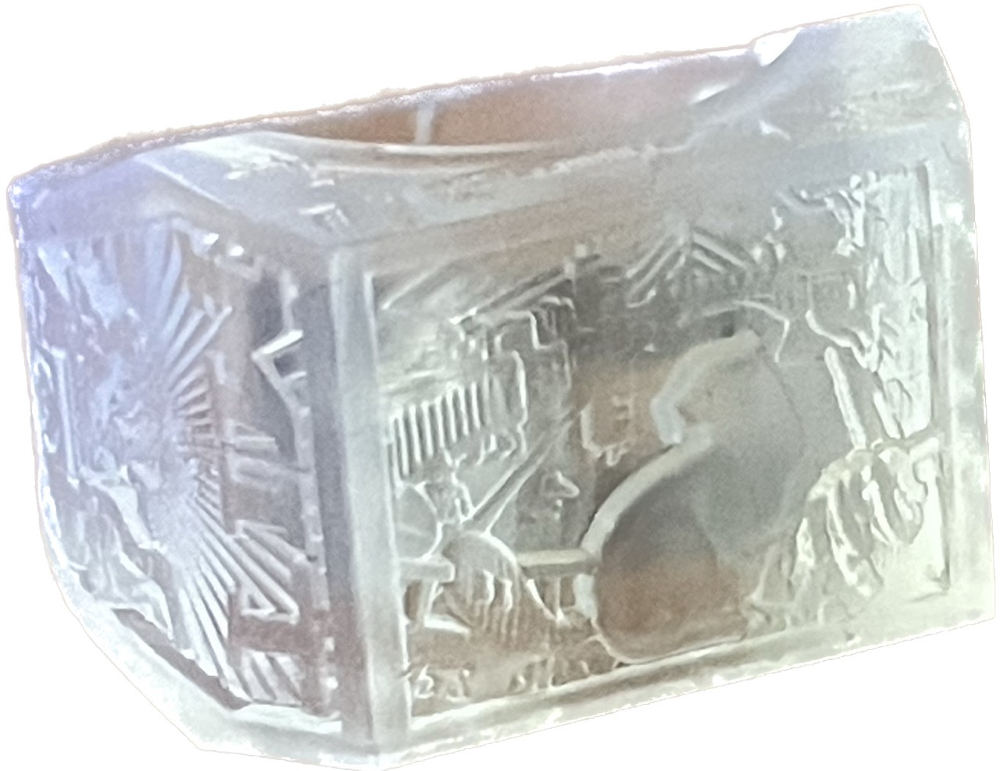

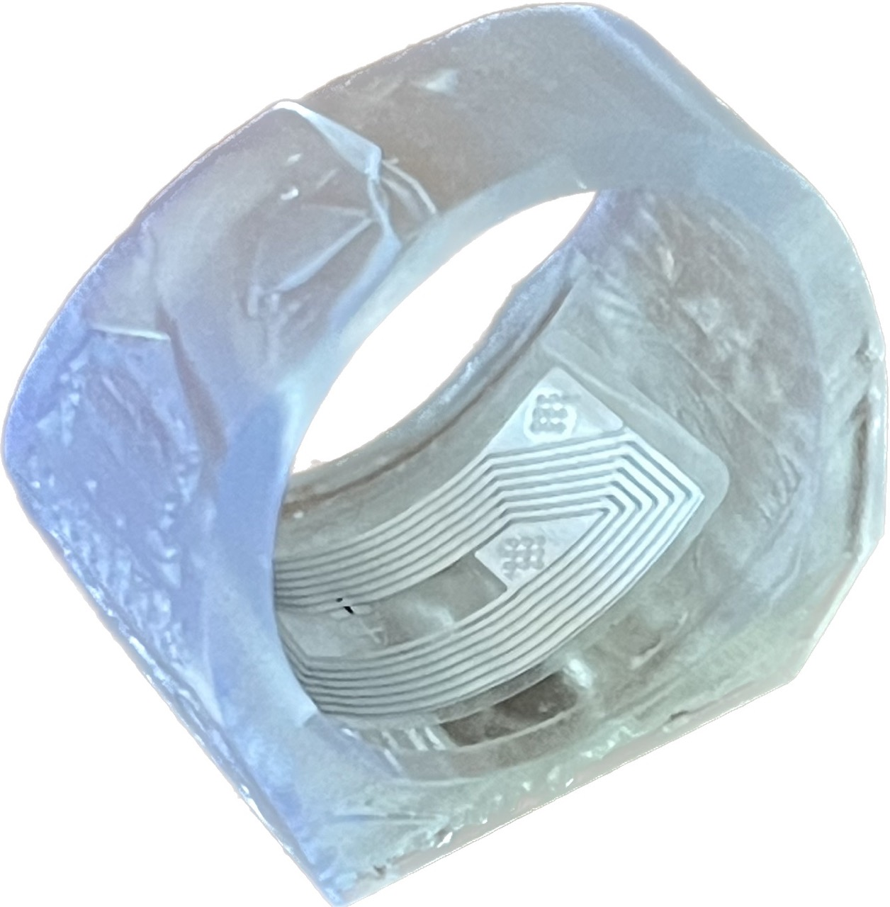

## NFC Brass Rat
I wear my class ring ([Brass Rat](https://en.wikipedia.org/wiki/MIT_class_ring)) just about all the time. But as far as cool functionality goes, it's a little underwhelming (no, the [hacker's map](http://brassrat.mit.edu/2025/design#map) does not count). This week I'm making a replica Brass Rat that will tap into MIT campus, dorms and other cool stuff.

## RFID? NFC?
The idea of a ring that functions as a wireless ID card isn't new; in fact, there's plenty of [commercial options](https://www.adafruit.com/product/2806) out there and even an [Adafruit tutorial](https://learn.adafruit.com/3d-printed-rfid-nfc-rings/overview) on 3D printing your own. But it turns out that replicating an MIT student ID card isn't trivial, and I spent the first few days of this week researching and sourcing parts. Here's a rundown of the situation.

So what is RFID? Well it stands for Radio-Frequency Identification, and its subset that we actually care about is Near-Field Communication (NFC). The "tag" (e.g. student ID card) is a passive chip and antenna that will be powered by and communicate with a reader (your phone, tap-access readers, etc.). This all happens wirelessly and the electronics can get to ridiculous sizes (I mean think about how slim NFC badges are).

The issue is that these were designed to be secure and have some measures against cloning. For example, MIT student IDs use the **Mifare Classic 1K** which have a 4-byte unique identifier _burned_ into the chip, permanently! So if you source these chips from the [manufacturer](https://www.nxp.com/products/rfid-nfc/mifare-hf:MC_53422), cloning is impossible.

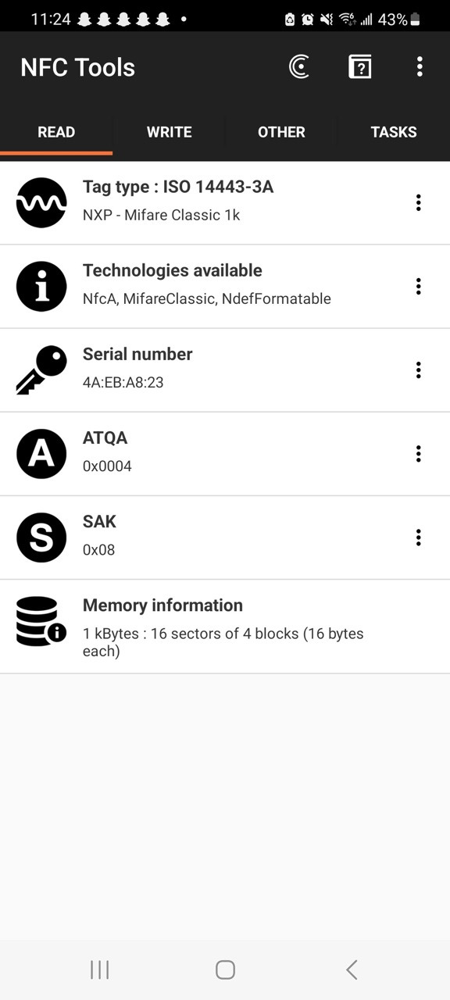
_Screenshot of NFC Tools, which I used to identify the chip_

So what do we do? Introducing **_Magic_ Mifare Classic 1K** cards. They're basically bootleg tags that, from the perspective of an NFC reader, behave exactly like their regular counterparts. The difference is that their 4-byte "unique" identifier is changeable. It's for that same reason that they're a little rarer, and I only have a week to purchase and deliver these parts so I'll have to do some fiddling around. Here's what I ordered:
- **NTag213 22x12mm** [(Amazon)](https://a.co/d/iaxHOyp)
    - Basically the perfect form-factor, but there's zero chance I will be able to clone my student ID card onto this chip. I have it as a last resort to do _something_ in case all of this fails.
- **Magic MIFARE 1K Key Tags** [(Amazon)](https://a.co/d/95gB7Mb)
    - I can clone my student ID onto these, but they're bulky. Even if I manage to remove the PVC casing completely, the antenna itself is still too large for a ring.

## Crop it, Duh!
A few days later, my packages arrived and it was time to test the NFC chips. I borrowed my friend's [desktop NFC reader/writer](https://a.co/d/gFieX9J) and successfully copied my school ID to the _Magic MIFARE 1K Key Tags_ but had no luck with the smaller _NTag213_'s.

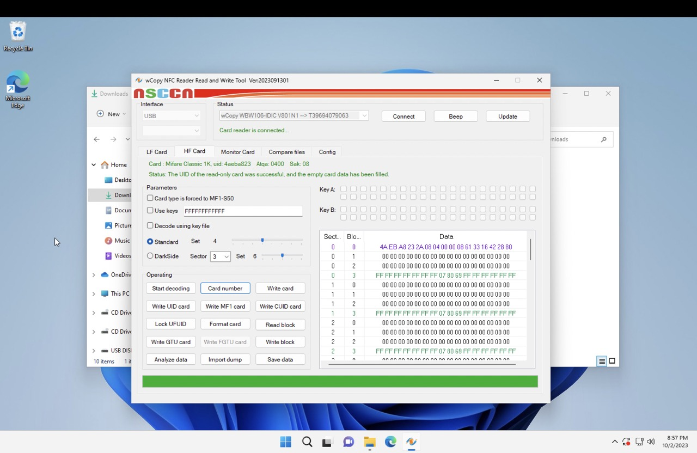
_The NFC writer's software looks pretty sketch but hey, it works!_

Now the only issue was this unfortunate form-factor:

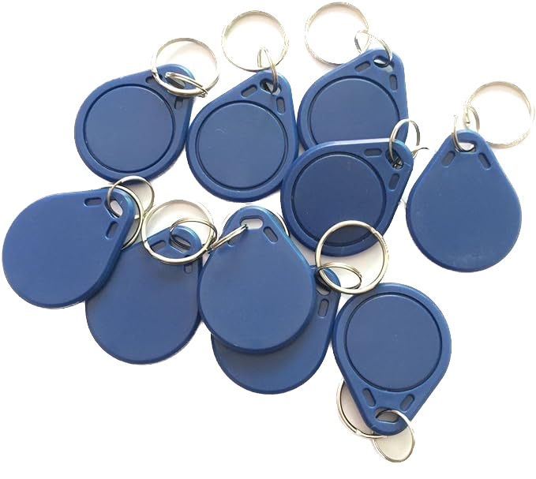
_Maybe I should've made a keychain?_

So, using a pair of needle nose pliers, I ~~obliterated~~ dissected the key tags mentioned above. And, well, the antenna inside of it is way too big like I thought.
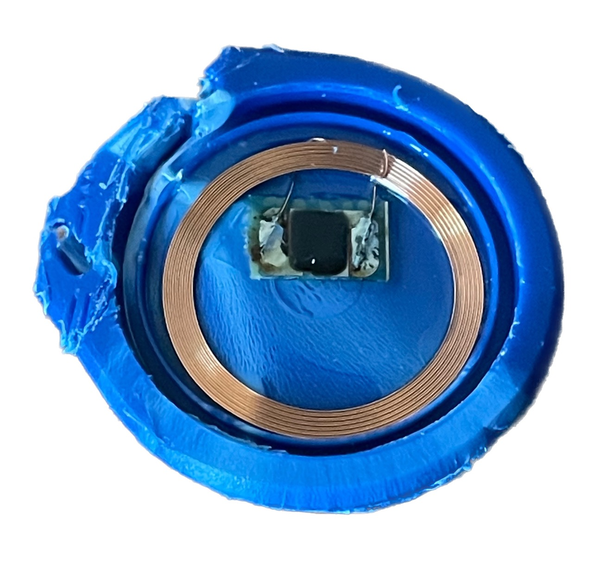
_The antenna are the coils of copper and the black dot is the chip itself_

But, since the copper is thin enough to be flexible, I was able to bend it to fit in the base of the ring. So it might look pretty bad but this ring will tap anywhere on MIT campus!

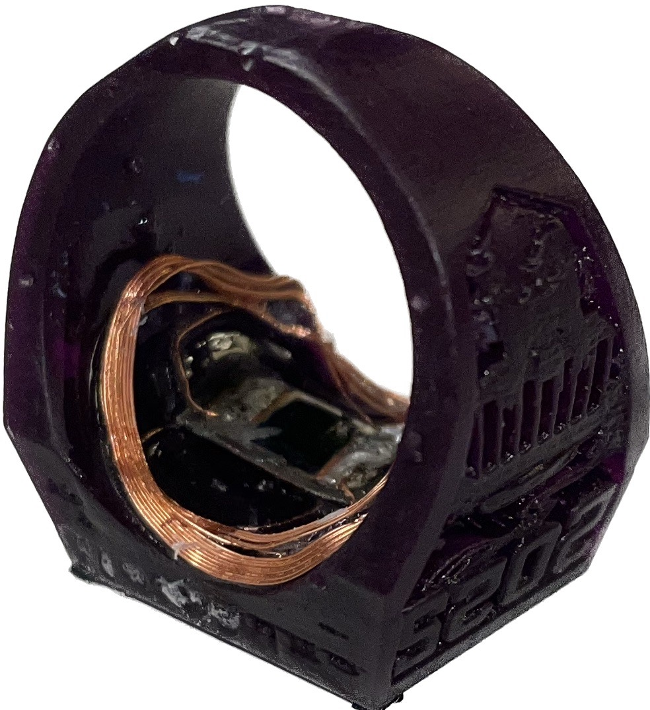
_It might not be very comfortable but the antenna isn't visible when worn_

## Surgical Procedures
_This section is something I'd like to try but haven't gotten around to yet_
For both NFC tags (the keychain and sticker), the only relevant part is the chip. The rest is an antenna, which just has to be a coil of some conductive material. So I'd like to transfer the working NFC chip onto the antenna of sticker tag, which has the right form factor.

## The Brass Rat
Ok so nerd stuff aside, I still need to replicate the brass rat. This week's assignment is 3D printing so I will be taking that route. Let's make a 3D model.
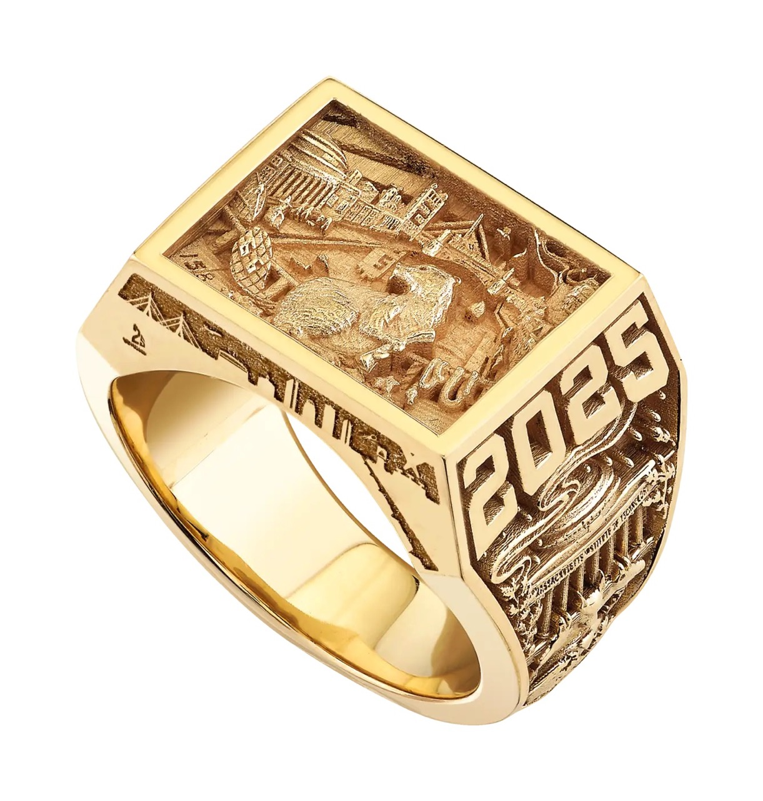
_Here's what I'm recreating_

The issue is I'm terrible at [digital sculpting](https://www.maxon.net/en/zbrush) and this model would be way too intricate to make by hand (let alone in a week!). Thankfully, the people behind the ring have an entire webpage dedicated to its design, with some really high resolution images (clearly they didn't take HTMAA)!

<video width="988" height="720" autoplay loop muted playsinline>
    <source src="assets/brass_rat_website.mp4" type="video/mp4" />
    Your browser does not support the video tag.
</video>

## Displacement Mapping
The 3D modelling technique I will be using is called [displacement mapping](https://en.wikipedia.org/wiki/Displacement_mapping). Basically, a greyscale image is projected onto dense 3D geometry and its vertices are moved along their normals, proportional to the lightness of the corresponding pixel.

<video width="1903" height="720" autoplay loop muted playsinline>
    <source src="assets/blender_demo.mp4" type="video/mp4" />
    Your browser does not support the video tag.
</video>

So I just need to convert the drawings of the Brass Rat's sides from [above](#the-brass-rat) into greyscale displacement maps and I should be good to go! There are a few different ways to do this; below is what I tried.

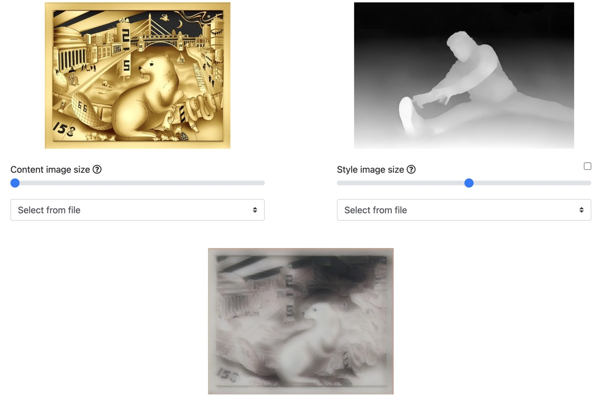
_**Attempt #01:** [This](https://reiinakano.com/arbitrary-image-stylization-tfjs/) style transfer of an image using a generic depth map_

 

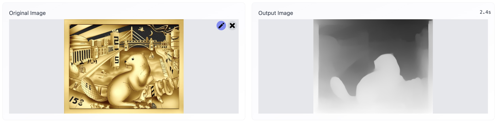
_**Attempt #02:** Using [this](https://huggingface.co/spaces/pytorch/MiDaS) AI depth-map generator_

 

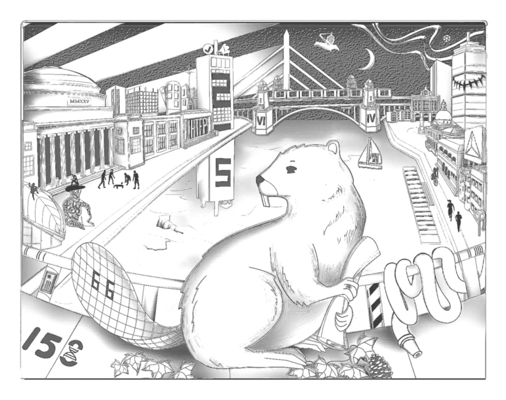
_**Attempt #03:** I asked ChatGPT to write an OpenCV script_

 

So clearly AI isn't taking our jobs just yet. The results above range from completely useless to lacking details to not understanding what a depth map is (even if there appears to be details, we don't just want contours!). So I will do it, _sigh_, manually in Adobe Photoshop.

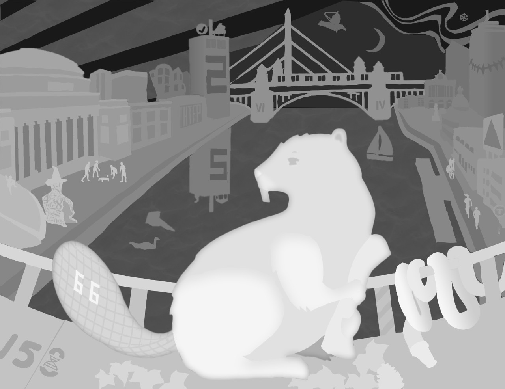
_**Attempt #04:** Well ya can't go wrong with manually coloring every detail :P_

## Ring Base
Now I needed to model the Brass Rat, minus all the details. Shout-out to [Shapr3D](https://www.shapr3d.com) for being an awesome CAD program, look at how satisfying this is:

<video width="1411" height="720" autoplay loop muted playsinline>
    <source src="assets/base_model.mp4" type="video/mp4" />
    Your browser does not support the video tag.
</video>

## Millions and Millions of Vertices
Here is the final result!
<video width="812" height="720" autoplay loop muted playsinline>
    <source src="assets/turnaround.mp4" type="video/mp4" />
    Your browser does not support the video tag.
</video>

## SLA Printing
It's pretty clear that the level of detail I'm seeking is near-impossible on any FDM printer (the type of 3D printers that deposit melted plastic one layer at a time). In fact, I didn't even try because the slicer software for the [Prusa i3 Mk3](https://www.prusa3d.com/category/original-prusa-i3-mk3s/) gave me some less than desirable previews.

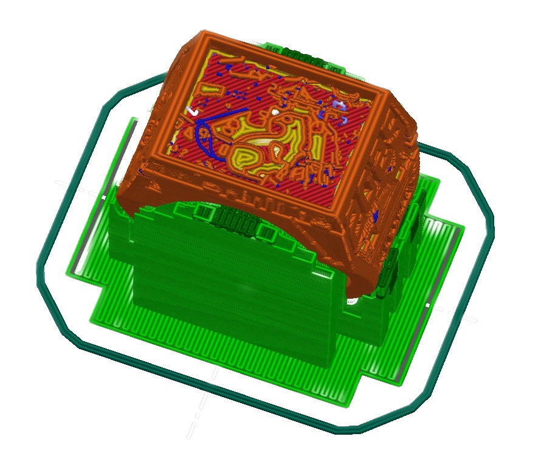
_The poor beaver getting massacred by very thick lines of PLA filament_

Instead I opted for the awesome [FormLabs Form 3+](https://formlabs.com/3d-printers/form-3/), a stereolithography (SLA) 3D printer. Both FDM and SLA work one layer at a time, but the latter has much better resolution and surface finish.

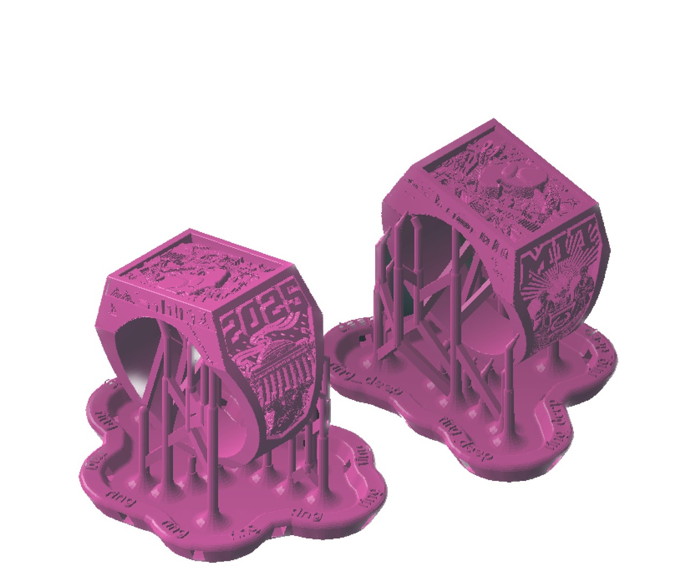
_Here are the rings in Formlabs' "slicer-software-equivalent"_

For any MIT students who are interested, I made these prints at [The Deep](https://project-manus.mit.edu/making-at-mit/our-system). From my minimal research, they have the best resin prices on campus (each ring cost me around half a dollar).

<video width="405" height="720" autoplay loop muted playsinline>
    <source src="assets/curing.mp4" type="video/mp4" />
    Your browser does not support the video tag.
</video>

## Roto281 Casting
_Planned for the future_

For this project, I'd like the final version to be made of real metal. The EECS lab section apparently has some roto281, which is an alloy with a really low melting point (well, 281º F). Using roto281 would have saved me a trip to [the foundry](https://metalslab.mit.edu/metal-classes).

## Electroplating
_Planned for the future_

This process deposits a very thin layer of metal onto a conducting surface. So, cheap roto281 turned to gold _(-ish)_ 🤑. Another option is spray painting the resin ring with conductive paint but none of the labs I reached out to had the resources to help me (and getting them myself is way out of budget).

## Lost-Wax Casting
_Planned for the future_

So it turns out that Formlabs sells [Castable Wax](https://formlabs.com/store/materials/castable-wax-resin/), which make the perfect investment for lost-wax casting. The process involves making a negative mold by (literally) burning away the positive part (which is made of wax). Then, any metal (even hotter than roto281 provided the right tools) can be poured in and casted. I printed using this and it turned out just as good as the [clear resin](https://formlabs.com/store/materials/clear-resin/) but melting this would've required temperatures way hotter than what EDS can do.

## Mold
As a last ditch attempt, I decided to print the negative mold directly out of resin, and pour the metal in _that_. It was made pretty quickly though (for this entire project, I am wrestling between lab open hours and printing time; it is logistical hell) and everything that could go wrong, went wrong.

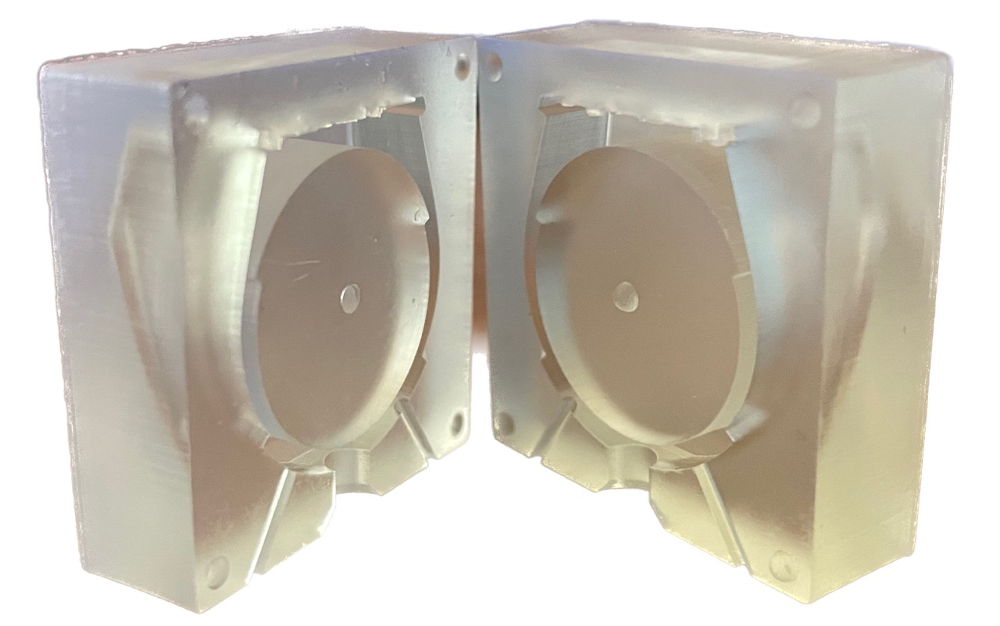
_To separate mold from cast, you'll probably need to break something. This should've been a three part mold!_

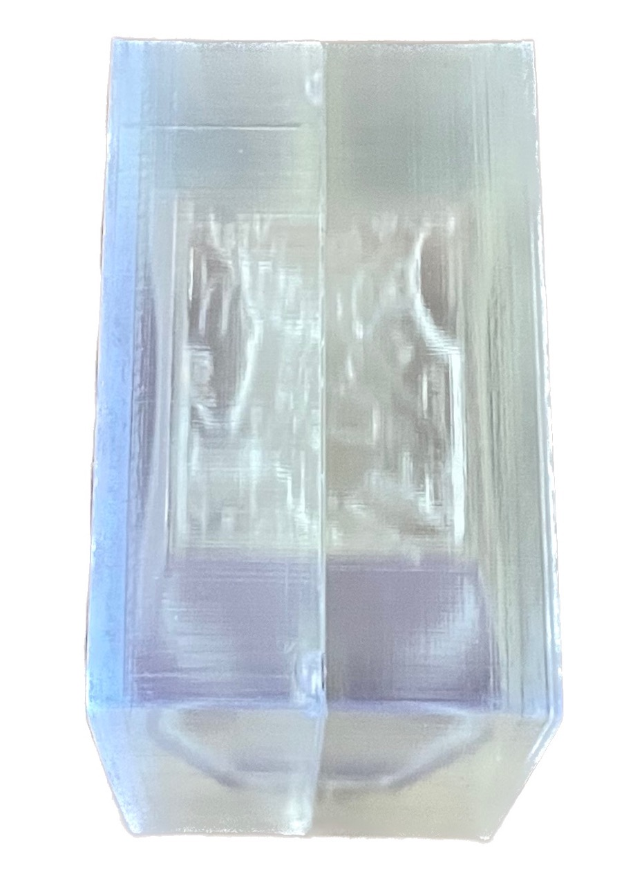
_I somehow messed up my UVs and printed the bezel in portrait orientation 🤦🏽‍♂️_

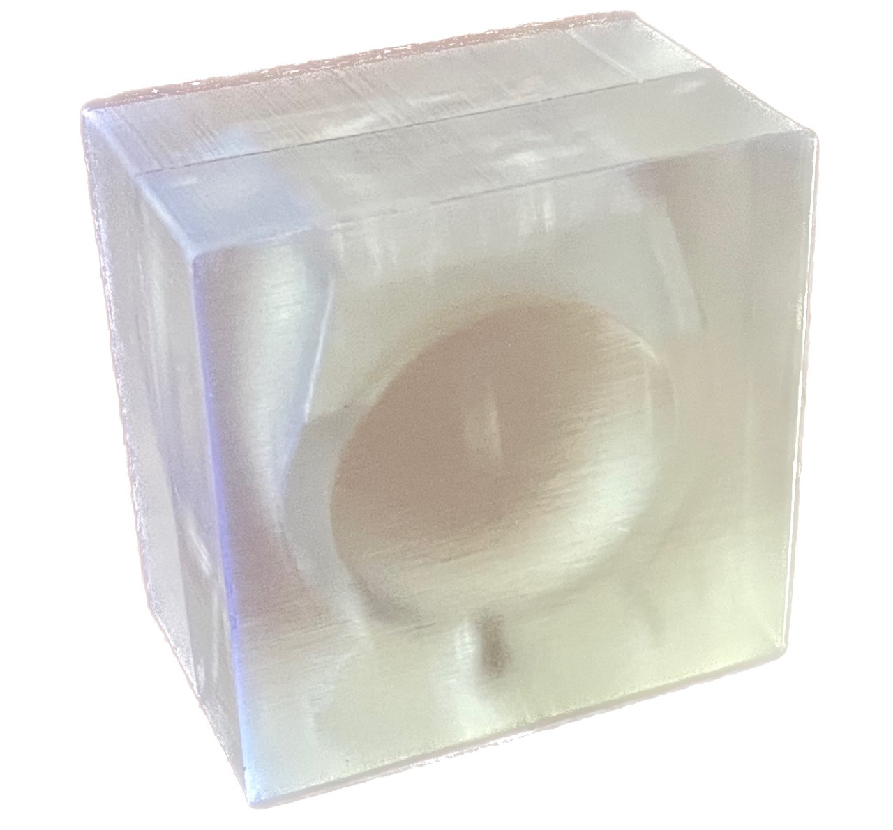
_And perhaps the biggest fail: I checked the datasheet after the print, this resin would've burnt if I used it to cast_

## Final Demo
So, lots of logistical failures this week but I technically accomplished what I set out to make: a brass rat that can tap into buildings. Here's the final demo:

<video width="405" autoplay loop muted playsinline>
    <source src="assets/final_demo.mp4" type="video/mp4" />
    Your browser does not support the video tag.
</video>

|                                       | Cost         | Can tap into buildings? |
| :-----------------------------------: | :----------- | :---------------------: |
| 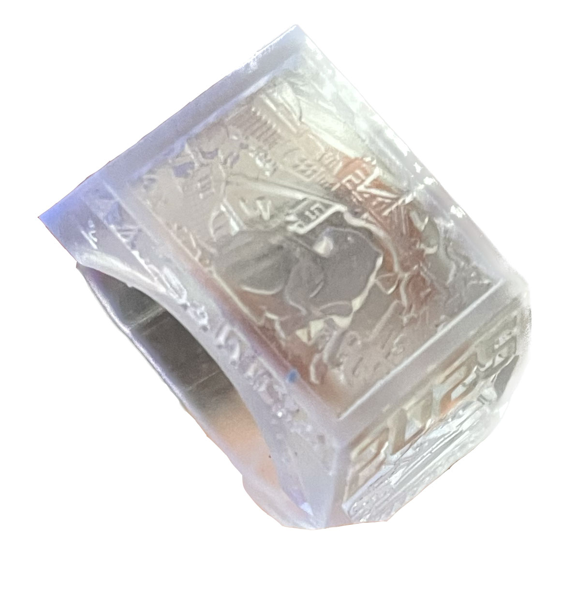 | $0.97        | ✔                       |
| 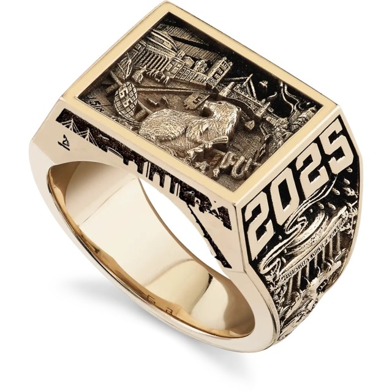 | $208 - $1857 | ✖                       |

So, in conclusion: meh, I'll improve upon this during [molding & casting week](http://academy.cba.mit.edu/classes/molding_casting/index.html).