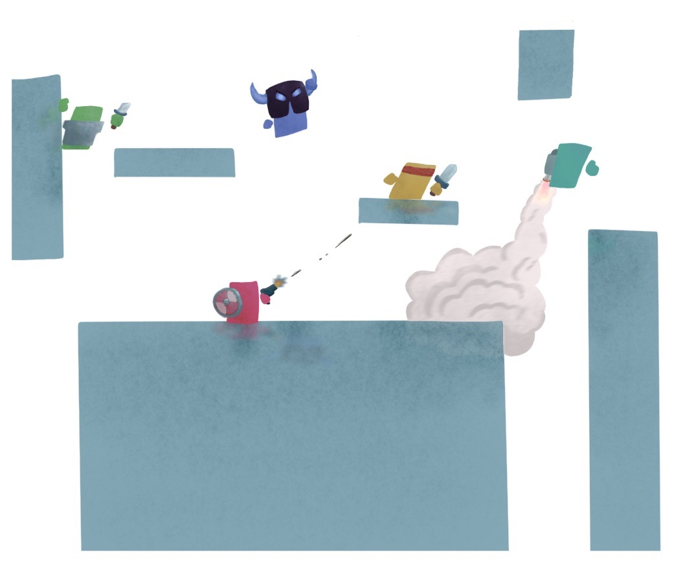
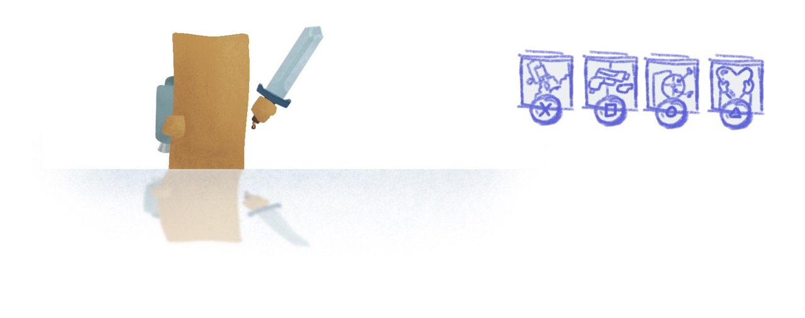
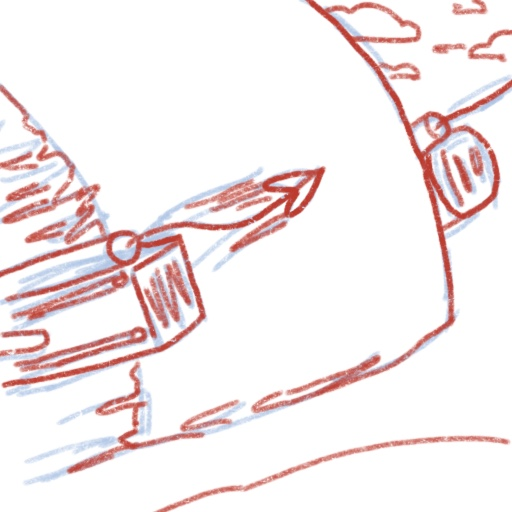
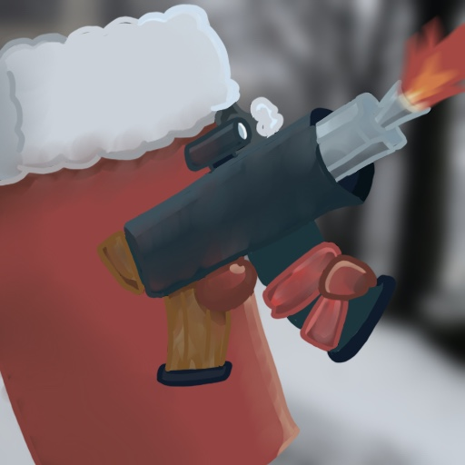
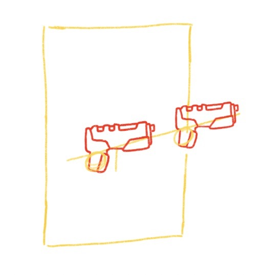
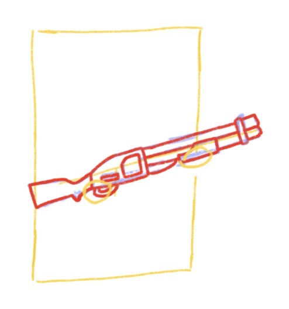
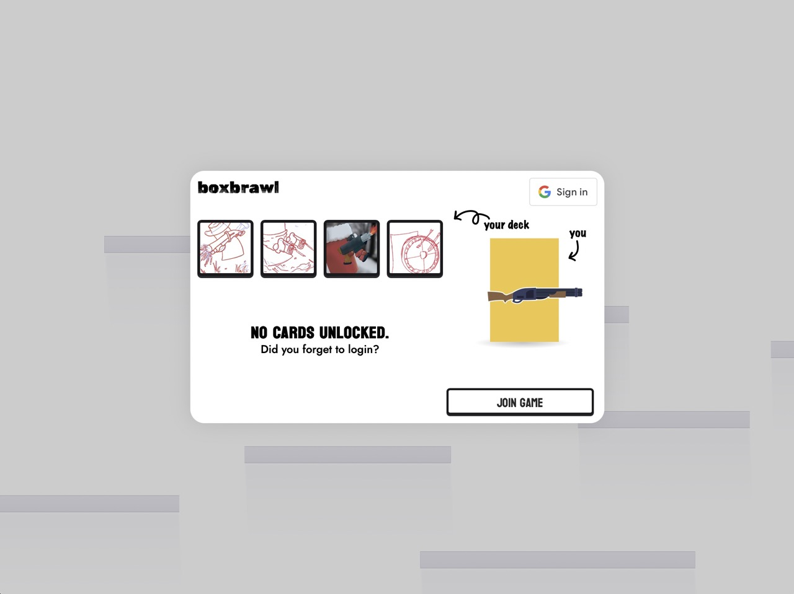

# Boxbrawl
_Welcome to "Over-Engineering a Simple .io Game 101"_

<video width="1250" autoplay loop muted playsinline>
    <source src="assets/preview.mp4" type="video/mp4" />
    Your browser does not support the video tag.
</video>

## An Online Multiplayer Game
This game is a brawler, similar to [Super Smash Bros](https://www.smashbros.com/en_US/), but with a twist: none of the characters are pre-made. Instead, players mix-and-match a fixed number of abilities/weapons/power-ups (similar to the deck building aspect of [Clash Royale](https://supercell.com/en/games/clashroyale/)). So it caters to all playing styles and incorporates strategy with the classic brawler genre.

The entire game runs in the web browser and friends play over the internet. For a while, I had some servers hosted on [Google Cloud](https://cloud.google.com/).

## UDP on the Browser
So as far as games are concerned, there are two protocols to communicate over the internet: TCP and UDP. TCP is nice because it'll ensure every packet is sent in-order and actually received. But that usually involves blocking previous packets and other non-negligible amounts of overhead that make things like movement and attacks really laggy.

UDP, on the other hand, just sends packets and hopes for the best. If something is lost, so be it. This is actually desirable for video games because realtime is more important than reliability; we always want the most recent packet as soon as possible and don't really care about the order/completeness thereof. Then, additional techniques can be employed to mitigate the effects of out-of-order packets with minimal overhead. I based my implementation of this on [this](https://gafferongames.com/) awesome blog by Glenn Fiedler.

The problem is that UDP on the web really sucks. [WebSockets](https://developer.mozilla.org/en-US/docs/Web/API/WebSockets_API) (which is built on TCP) is already easy, and things like [socket.io](https://socket.io/) help too. But for UDP, [WebRTC](https://webrtc.org/) is our only option. It's very boilerplate heavy and is designed to be peer-to-peer, whereas I want a server-client architecture (server authoritative games are generally better at preventing cheating). Thankfully, I found this library called [geckos.io](https://geckos.io/) which provides a _socket.io_-esque interface over WebRTC.

## Entity Component System (ECS) and Server Authoritative
The project structure at a glance: I'm using an [ECS](https://github.com/Ralith/hecs) so everything in the game world is an entity. I built a custom game engine for this project so just about everything was thought around this _ECS_ paradigm. For example, I made a physics engine from scratch that relies on **Velocity** and **Mass** components; most other engines (well, namely Unity) copy data back and forth between the world and some third-party physics engine so ECS is just an afterthought.

As for networking, I'm making the game server authoritative. That means that the server has the final say in every interaction which greatly reduces the amount of cheats possible. For example, the client sends user inputs (literally "I am pressing the right arrow key") and the server responds with everyone's _actual_ position. Of course, I added some tricks like client-side prediction, interpolation and reconciliation to make the whole thing feel seamless. I think this is where UDP truly shined because these techniques rely on as close to realtime as possible.

## Rust on the Browser & Node
I wanted to use [Rust](https://www.rust-lang.org/) on this project. It's a systems language and would be a really good choice for a more intensive game; in this scenario it's completely overkill but I wanted to use it anyways.

Getting Rust on the web and node.js isn't too bad and is just a matter of changing the build target to [WebAssembly](https://webassembly.org/) and accepting a few caveats (e.g. **no-std**). What I think is really cool, however, is the FFI boundary between Typescript and Rust and how ECS helped a lot. For example, the graphics are just [&lt;svg&gt;](https://developer.mozilla.org/en-US/docs/Web/SVG/Element/svg) elements and I wrote an **extern "C"** function that queries every **Sprite** and **Position** components as well as their corresponding **EntityId**. So in this scenario I have retained graphics that are "abstracted" across the FFI boundary and made convenient by the ECS.

One more thing: the server and client work off the same code base. A common pattern in online games is to have two projects, _client_ and _server_. They are usually disjoint for the most part and I experimented with doing a little better. What I ended up using also makes use of ECS and involves selectively adding components/systems based on the compilation target (client or server). So code duplication is kept at a minimum and the corresponding client/server-authoritative bits of codes are next to each other in the source. This approach isn't perfect but I thought it was neat.

## User Accounts
I implemented [Google's OAuth 2.0](https://developers.google.com/identity/protocols/oauth2) into this project to save user's decks. Originally I wanted to have a card-collection system but I never got around to it. Data storage is then done in [MongoDB](https://www.mongodb.com/).

## Graphics
The sprites were sketched in [Procreate](https://procreate.com/) and cleaned up in [Adobe Illustrator](https://www.adobe.com/products/illustrator.html).

_Early sketch of the game_

_The UI was also sketched out beforehand_

_Draft for one of the ability icons_

_Example of a cleaned up icon, this time in Procreate_

_Sketch for the "dual guns" weapon_

_Sketch for the "shotgun" weapon_

_And here are some of these things, finalized, in the main menu!_