# Contact

<iframe src="https://player.vimeo.com/video/1033163269#t=1h43m43s?badge=0&amp;autopause=0&amp;player_id=0&amp;app_id=58479" frameborder="0" allow="autoplay; fullscreen; picture-in-picture; clipboard-write; encrypted-media; web-share" referrerpolicy="strict-origin-when-cross-origin" style="position:absolute;top:0;left:0;width:100%;height:100%;" title="Dec 9 - 2.009 Finals - 6413"></iframe>

    <i>(Demonstration of the product starts at 1:43:43)</i>

## 2.009 Product Design
During my senior fall at MIT, I got the exciting opportunity to take 2.009, a semester-long mock start-up class about product design. With about a dozen other engineers in my group, we were tasked with ideating, designing, and manufacturing a complete product in just two short months. And at the end of it all, we presented it on stage, live, in front of a couple thousand people (see above)!

## The Idea
The very first thing that we did － and spent a critical amount of time on － was coming up with a bunch of ideas around the class' theme of "Balance." Most concepts only ever saw the light of day through sketches or mere words, and some had extensive research and feasibility analysis before ultimately landing on one idea. From this arduous process of brainstorming emerged our product, which we called *Contact*.

<!-- 
 -->
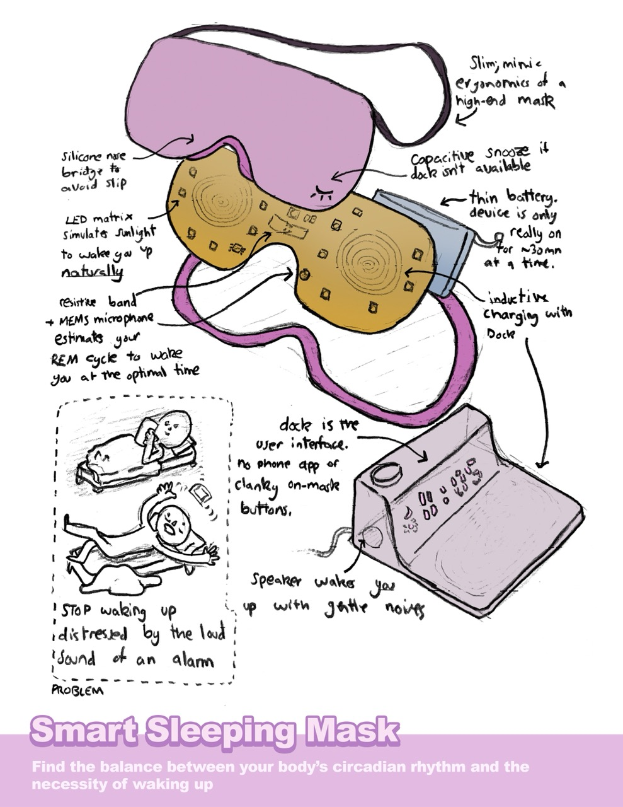
<video width="320" autoplay loop muted playsinline style="flex-shrink: 1">
    <source src="assets/sleep_turnaround.mp4" type="video/mp4" />
    Your browser does not support the video tag.
</video>
<!--   -->
<!-- 
 -->
One of the ideas I presented that got scrapped

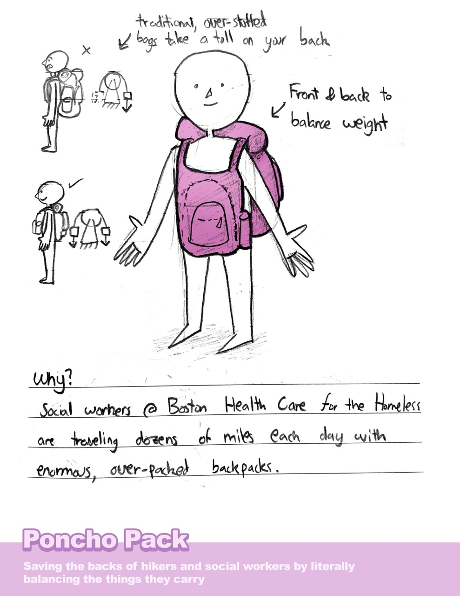
_Not all ideas are good, and this one got scrapped pretty much immediately_

## The Problem
The presentation video (above) does a much better job of explaining this, but the problem we addressed was children's safety while biking/skateboarding/scooter-ing. Essentially, while kids these days are essentially born with an iPad in their hands, a surprising amount don't own a mobile cellphone that would save them in a pinch. There's no worst feeling than walking your bike home with a bruised knee and dried up tears. For parents, that lack of _contact_ (heh. see what I did there?) is stressful, and only amplified when their child is biking around the neighborhood or to/from school.

So we sought to fix that by designing a product that does the following:
1. Keep children connected, no matter where they are, without giving them a cellphone (let's not make the iPad kid epidemic worst)
2. Allow parents to track their child's location
3. Automatically detect "booboos," "crashes," or worst; we don't think kids should have to suffer through any injury by themselves
4. Enable the child to contact their guardian manually, in case our crash detection fails or whatever else happens
5. Lastly, the device should be something you "forget about until you really need it," kind of like an AirTag; it'd be pointless if you had to charge it every night

We wanted to give parents peace of mind without impeding on their child's freedom to explore the world.

## The Solution
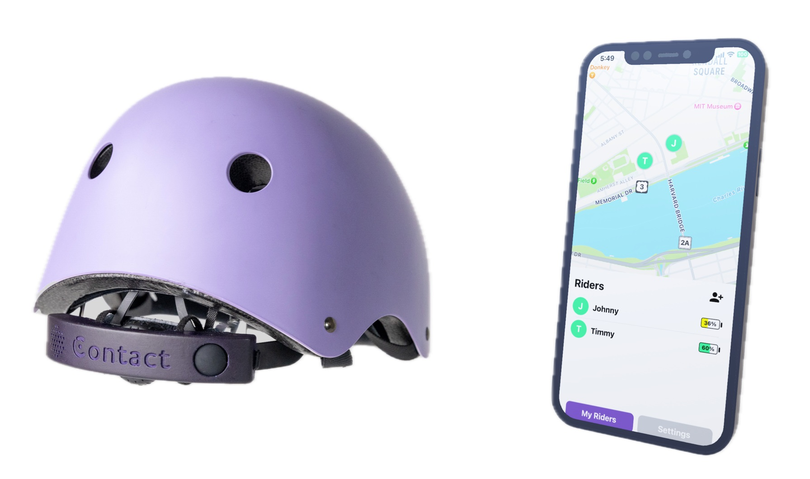

So what did we build?

_Contact_ is essentially a phone in the form factor of a helmet attachment; it connects to the LTE network, has GPS built-in, makes calls (ish), and, like [Apple's  crash detection](https://support.apple.com/en-us/104959) will call for help in case of accidents. Of course, parents could just buy their kid a phone, but our product is specifically tailored towards children who ride their bike without supervision. This has numerous advantages:
* No need to give young children a smartphone!
* _Contact_ will last a while without needing to charge (iirc ~1 month)
* Safety (crash detection) is at the forefront of _Contact_, whereas on other products it is an afterthought (the iPhone was not designed for crash detection)
* Battle tested! _Contact_ is tough to crack, perfect for even the most reckless of kids
* And it's way cheaper. We estimated this product would ship for $75 (at the time of writing this, an iPhone 16 is $799)

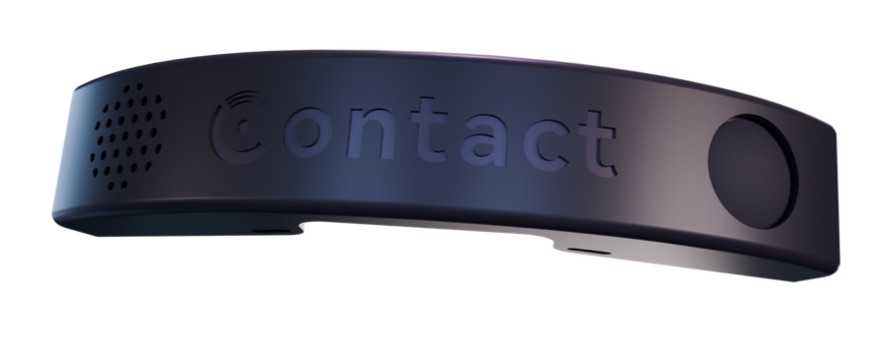

## Electronics
Since this class is a mechanical engineering capstone, it was a tad ambitious to pursue such an electronics-heavy project. Thankfully, I'm actually an EECS major and my team is super smart and learned quickly. I contributed to _Contact_'s circuit board and firmware.

Like I said, _Contact_ is essentially a smartphone minus the screen. **And** it has to be _ultra_ compact since kids don't want to wear a clunky box on their head. **And** it has to be considerably cheaper than a smartphone, otherwise the incentives to purchase this product would be slim. As it turns out, this is a really hard problem because all of these modules need to be packed in a small form factor without exploding the budget:
* GPS
* LTE chip
* _Two_ antennas for GNSS and LTE
* SIM card tray (e-SIM is somewhat modern, and supporting it was deemed too pricey)
* Speaker
* Speaker driver
* Microphone
* Button/LEDs for user (child) interaction
* IMU for crash detection
* Battery charging + USB port (has to be convenient for users)
* Microcontroller (the brains)

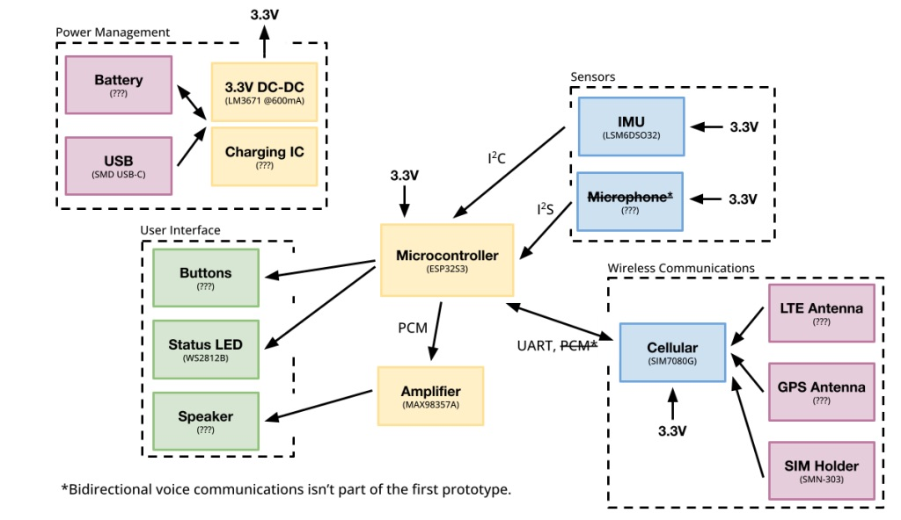
_Early systems diagram, before building anything. Amazingly we were able to fit everything mentioned here in the final prototype_

I think I ended up designing ~6 different boards in these two months. About half of those are revisions, and the rest are completely new designs. Yes, we dropped multiple $100s more than once on express shipping. And yes, they were all assembled by hand, in [EDS](https://eds.mit.edu/), because assembly in PCB houses takes another 3-4 days (Anthony & Alec, you'll probably never read this but you're the best, thanks for keeping lab open so long!!).

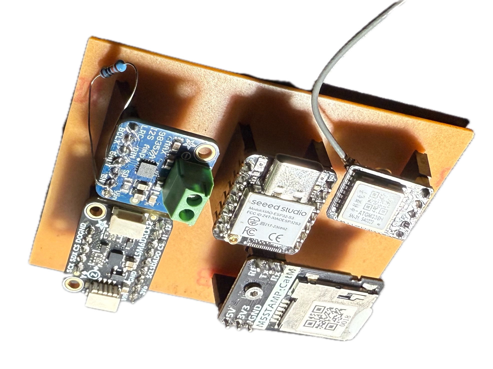
_First version of the board. Massive, and expensive, but worked well enough for a proof of concept._

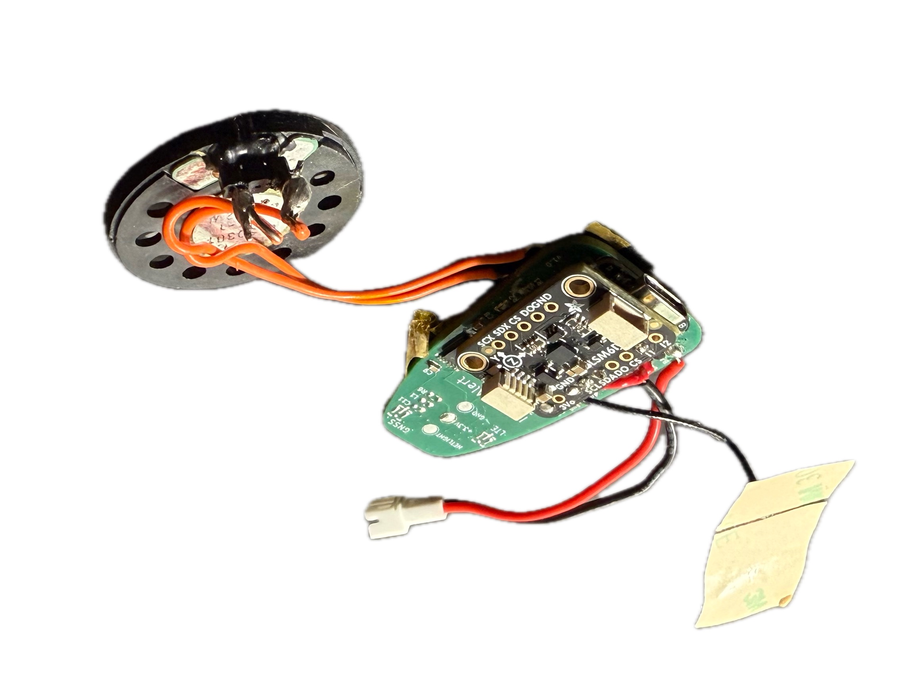
_Same circuit as above, but this time on a PCB! The IMU didn't work though, so we fixed a breakout board on top..._

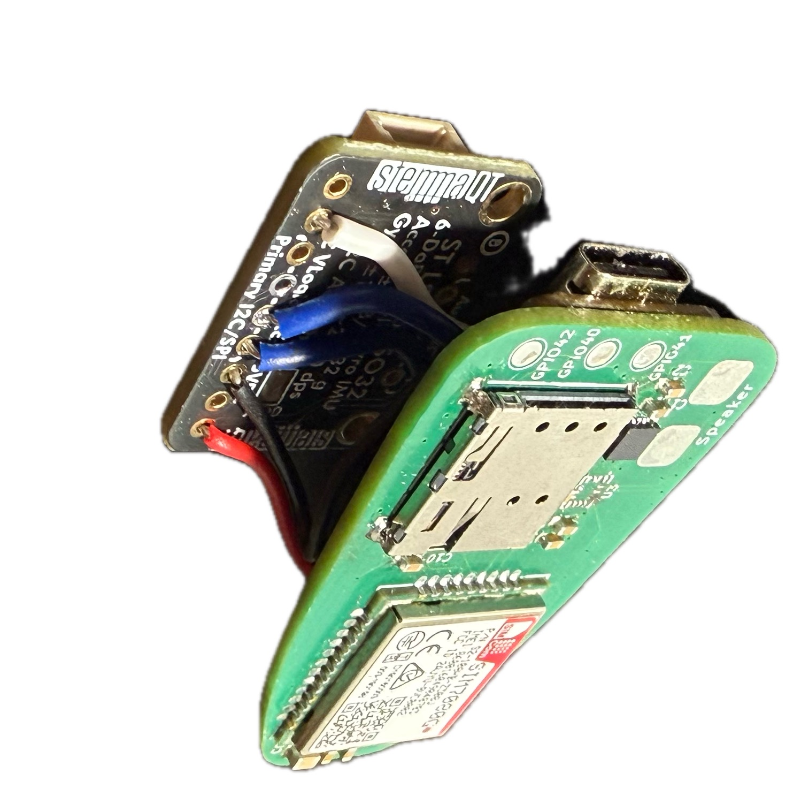
_First revision. IMU still didn't work! Damnit!_

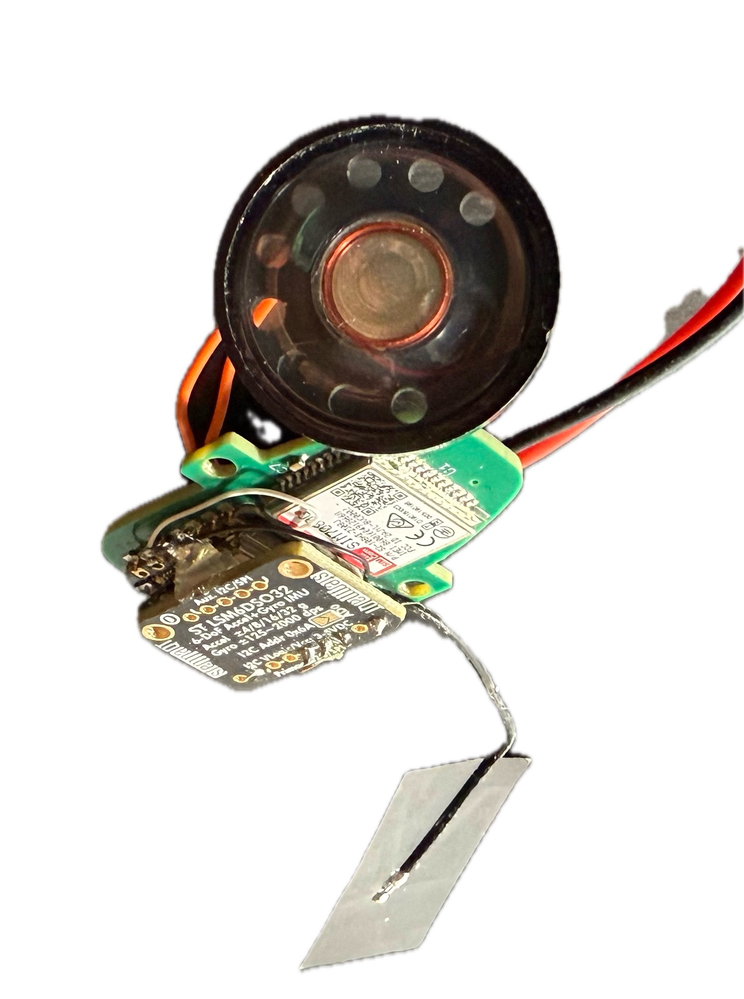
_Second revision. I must be cursed, these I2C lines to the IMU just don't want to work_

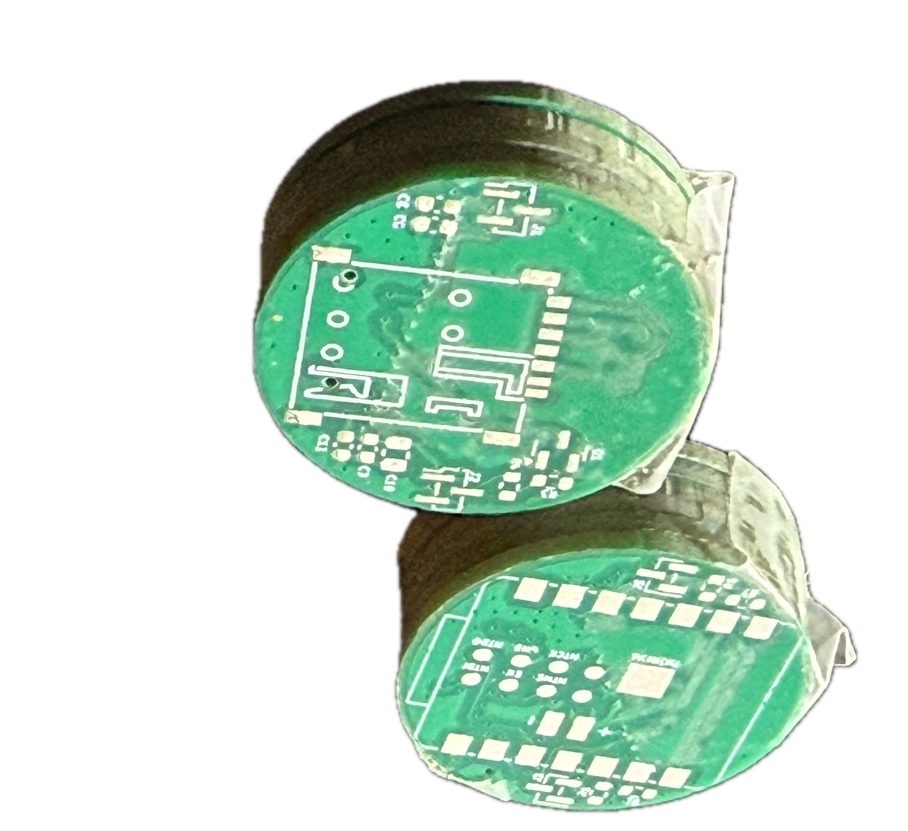
_These boards are a completely different design, we were considering a "sandwich" approach to slim down a tad_

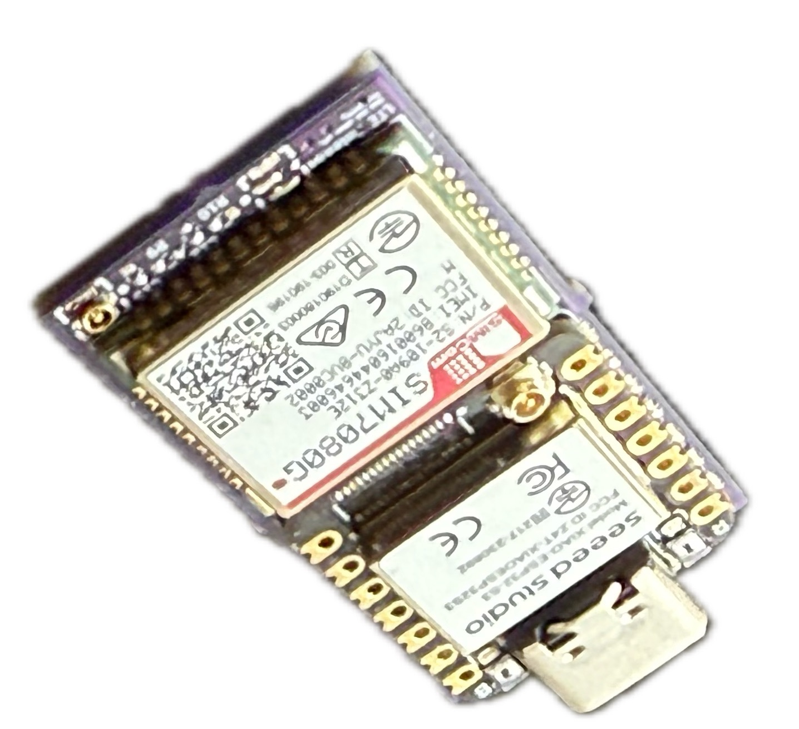
_At last, the final version (I skipped a few because you get the point)_

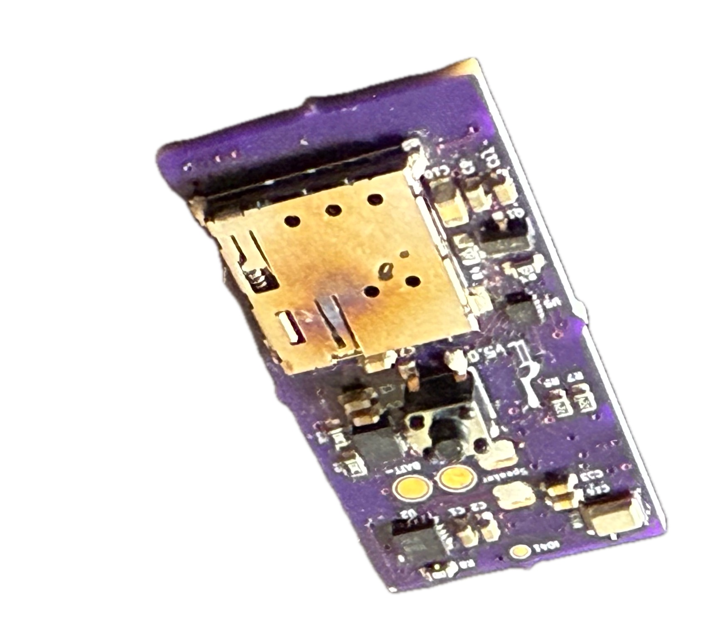
_Underside. Ignore the slightly overcooked SIM tray_

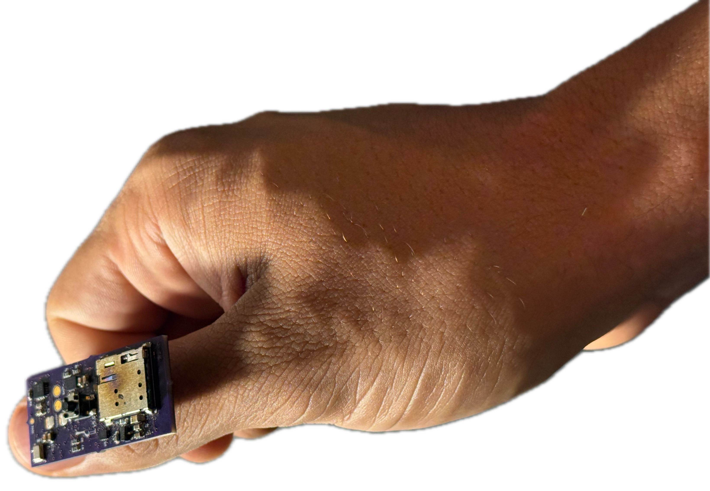
_I hope you can appreciate just how small this thing is. There is zero wasted space!_

Once again, that small board really does integrate every demand listed above. And it's dirt cheap, about $20 even at low-volume prices. These incremental improvements in size are most appreciable through the enclosure, which started at something ridiculous.

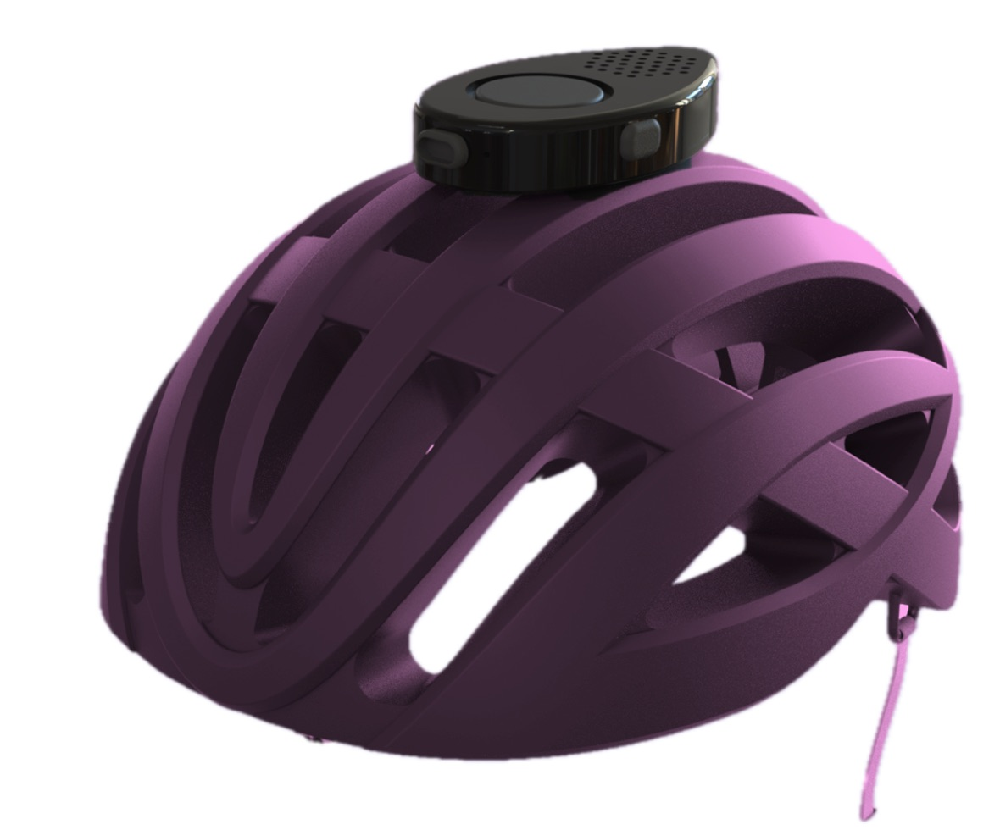
_First PCB would've resulted in this bulky form factor_

I designed all these on KiCAD, and ordered through JLCPCB, PCBWay, and OSHPark. If you must know, JLCPCB was by far the best option.

## Firmware
We used Micro-Python and Arduino over the course of development. These are easy to pick-up and work well enough, and different people implemented different functionalities separately. When it came to integration, however, everything sucked. Although I'd planned for us to use FreeRTOS (which Arduino uses under the hood) to "run separate programs concurrently", assuming everything would "magically click" was a mistake. Then I just re-wrote the entire firmware in Rust using [Embassy](https://embassy.dev/) and everything magically clicked.

## LTE/GNSS
Wireless connectivity was one of the hardest parts of this project. Technically the final product has both WiFi and Bluetooth, but of course these don't work outside in the streets. So we looked towards 2G/3G/4G/LTE and vetted a few dozen chips. Now, this isn't that hard of a problem if you're willing to dish out ~$100 on a well documented chip. But we needed to go much, _much_ cheaper which landed us on the *SIM7080G*.

All things considered, it's a great chip. For under $10, it provides GNSS, LTE (Cat-M1 and NB-IoT) and miraculously supports the US bands. The issue was documentation --- very hard to find and all existing firmware was either buggy or incomplete. You interface with it using [AT commands](https://en.wikipedia.org/wiki/Hayes_AT_command_set), a 1981 standard for interfacing with modems. Ridiculous, right?

Over the course of 2-3 weeks, I _struggled_ getting this thing to work. Most of that time was spent cross-referencing library implementations (they sucked on their own, but maybe together?) and looking for any semblance of documentation. I'd get _some_ things working, but very inconsistently as if it were up to luck.

Things really picked up when I asked for some help, though. I made an AT command REPL to easily talk to the chip (the hard part is what commands to send and in what order), and with a few people on the team we cracked it. The last part was packaging all our findings into something reliable, because at some point the REPL itself (implemented in Micro-Python) started being the failure point. So I wrote a custom AT command parser that works with the SIM7080G's quirks, and async drivers for the chip with failure recovery (again, in Rust and using Embassy).

## Leadership, kinda?
Since I led the EE and firmware teams for _Contact_, I got a bit of leadership experience. Of course, everyone on the team is cracked so my job wasn't super difficult, but I learned a lot about planning things out and delegating work. The most fun part though is showing off what we've been working on to the rest of the team; here is one of those update slide-decks.

<iframe src="https://docs.google.com/presentation/d/e/2PACX-1vSqu3zmo5CJwJZChyKgu7t03d2iA1xVoyJDd4j9qoVi1WiNX6mRYY63jKcR-ghVl_V-bbT9jHl8Iw8R/pubembed?start=false&loop=false&delayms=3000" frameborder="0" width="320" allowfullscreen="true" mozallowfullscreen="true" webkitallowfullscreen="true"></iframe>

## Crash Detection
This subsystem was led by another sub-team, but I helped a bit as they needed some electronics stuff early on (i.e. couldn't wait for the PCB and firmware to be complete first).

I threw together an accelerometer + gyroscope thingimabob wrapped in a lot of bubble wrap. It communicated to a host laptop using ESP-NOW, and streamed sensor data in realtime and a very high throughput. Then, the host laptop would process this data using a Python sandbox. The idea was to abuse the sensor thingimabob and gather valuable data, while also prototyping algorithms for crash detection.

<video width="320" autoplay loop muted playsinline style="flex-shrink: 1">
    <source src="assets/debug_prgm.mp4" type="video/mp4" />
    Your browser does not support the video tag.
</video>

This is something I threw together in an evening and was helpful until the end. Strictly speaking, it's a "complex" program (maybe not so much these days with vibe coding getting so much better) with UI, serial communication, graphing and a Python interpreter. It's really a testament to how nice the Rust ecosystem is that this velocity is possible at all.

## Conclusion
I can only speak of the work that I did, since I remember it best. But this little entry doesn't even begin to cover the incredible amount of work that went into _Contact_. The enclosure, antenna considerations, mounting, logistics, financials, crash detection, marketing, user surveying, and so many other things were handled by the rest of the team. I'm so glad I got to take 2.009 and work with a team of incredibly talented engineers, and to have had the honor to present it on stage in the end.