# Drone
<video width="874" autoplay loop muted playsinline>
    <source src="assets/preview.mp4" type="video/mp4" />
    Your browser does not support the video tag.
</video>

## DI(almost all)Y Drone
This project involves building and programming a quadcopter. You may ask: _it seems everyone these days is making drones, isn't it just about buying a couple of motors and a kit?_ No, I'd like to push myself and make every component of a [flight controller](https://www.getfpv.com/electronics/flight-controllers.html) from scratch1.

What does that include? Motor speed controllers (x4), RF communications, inertial unit and a program to bring them all together.

1Something something apple pie, invent universe or whatnot

## Lore
This will be my second time attempting this exact project. Last I tried, I was a freshman and fully prepared to fail my embedded systems class for a cool, over-ambitious final project.

<video width="320" autoplay loop muted playsinline>
    <source src="assets/old.mp4" type="video/mp4" />
    Your browser does not support the video tag.
</video>

Above is the gist of my development. It was with that project that I first learned to CAD, so most of my time went there and the electronics were more of an after thought (hence the nightmare through-hole stuff going on). And, well, it "flew" _once_. Then the crash shorted the spaghetti mess going on at the base and that was it.

## PCBs to the Rescue!
So this time around (well actually everything is different now because I lost all the files), I'm taking a much better approach: PCBs! And it so happens that this week's assignment is designing a circuit in an [EDA software](https://www.kicad.org) that we'll bring to life next week.

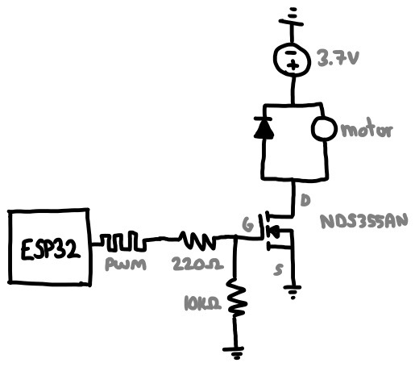
_Sketch of a single motor controller circuit_

The first part of this PCB is the motor controller, which revolves around the idea that we'd like a [microcontroller](https://www.seeedstudio.com/Seeed-XIAO-ESP32C3-p-5431.html) to modulate the speed of a motor but its pins cannot directly power it. That's because motors are really power hungry and one with load (let alone four) will definitely not work and perhaps fry the on-board regulator.

So we offload that task to a voltage controlled current source, such as a MOSFET. The MCU's pins can regulate voltage (via PWM), and the MOSFET will comfortably allow a lot of current to fly through it. I used the [NDS355AN](https://www.digikey.com/en/products/detail/onsemi/NDS355AN/458899) because it's what we have in lab, but let's double check its ratings to give the illusion of choice.

_I asked [ChatGPT](https://chat.openai.com/share/aaaea459-ebbf-4202-aec6-4427dcbef94e) how to interpret a FET datasheet_

Here are the important design requirements for this particular application:
1. V_gs(th): ~1.6V at the gate for FET to start conducting. 3.3V is comfortably above this
2. V_gss(max): 20V continuous, 3.3V is way below that
3. I_d(max): Maximum drain current is 1.7A continuous, 10A pulsed which should be fine for the [motors](https://a.co/d/aQAp52E)
6. V_ds(max): Maximum drain-to-source voltage is 30V, comfortably above 3.7V

And now some details/decisions about my circuit for anyone wondering:
- I'm using an N-channel MOSFET, so the source goes to ground. That means battery -> motor -> MOSFET -> ground.
- The diode is used to [eliminate flyback](https://en.wikipedia.org/wiki/Flyback_diode), i.e. back-emf generated by the motors
- The 10kΩ [pull-down resistor](https://www.electronics-tutorials.ws/logic/pull-up-resistor.html) eliminate floating voltage levels at the gate, e.g. when the pin is off

## Fusion360? Eagle?!
I tried using [Fusion360](https://www.autodesk.com/products/fusion-360/overview?term=1-YEAR&tab=subscription)'s circuit and PCB design suite. It sucked, never again.

## KiCAD
I tried [KiCAD](https://www.kicad.org) next and had a much better experience. The first task was replicating my circuit digitally:

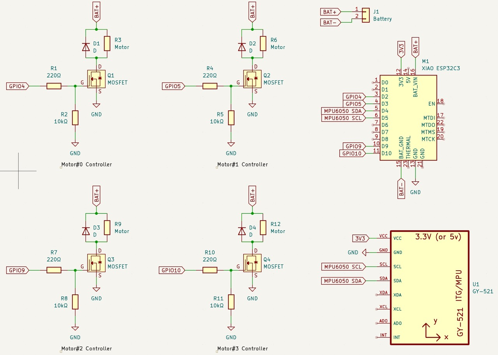
_Complete circuit_

Then I need to arrange everything in circuit board land:

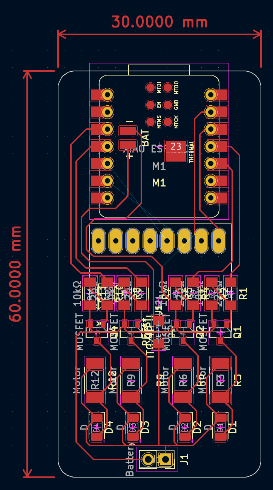
_PCB design I came up with_

## 3D Printed Frame
The drone frame is very simple and fitting the motors and board takes advantage of the PLA's compliance. I got this idea from [here](https://youtu.be/7t_6z_lC5pQ). On a [Prusa](https://www.prusa3d.com/category/original-prusa-i3-mk3s/) this took 24mn to print, and this design is about 30mn of work in [Shapr3D](https://www.shapr3d.com). So the frame only took an hour; neat!

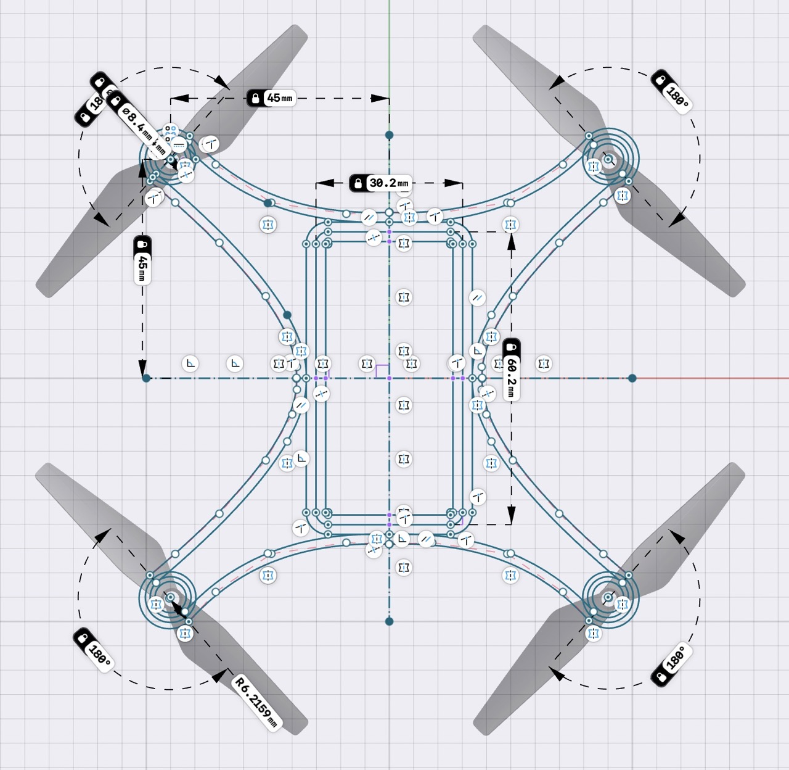
_The frame is flat, so there's only one sketch_

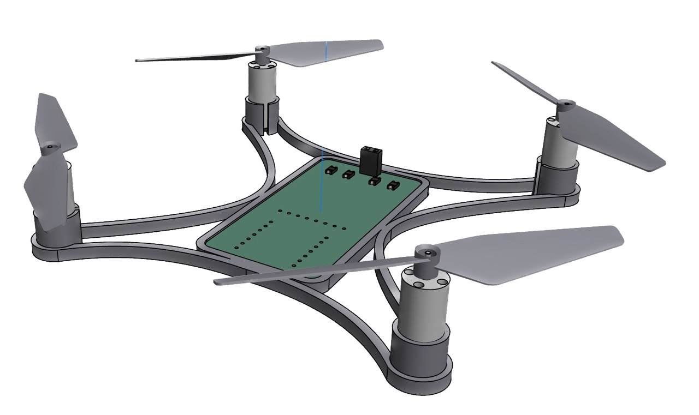
_Visualization of the final drone. I used these [two](https://www.thingiverse.com/thing:3548275/files) [models](https://grabcad.com/library/8520-coreless-brushed-motor-1)._

## PCB Milling
This is technically next week's assignment, but I wanted to get a head start. In the EECS lab section, we're using the [Bantam Tools](https://www.bantamtools.com) CNC mill.

<video width="1280" autoplay loop muted playsinline>
    <source src="assets/cnc.mp4" type="video/mp4" />
    Your browser does not support the video tag.
</video>

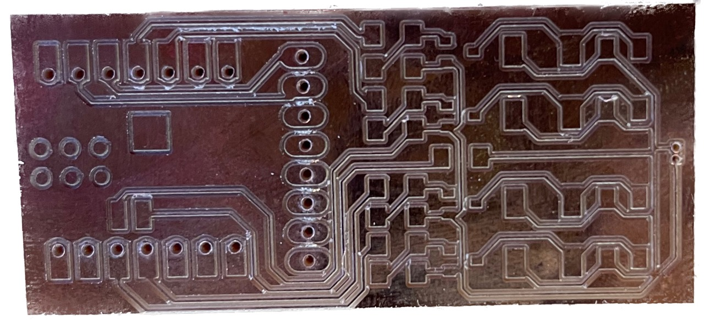
_One of the earlier boards I milled_

## Electronics Assembly
I used SMD components, solder paste and a hot plate/air station to assemble everything.

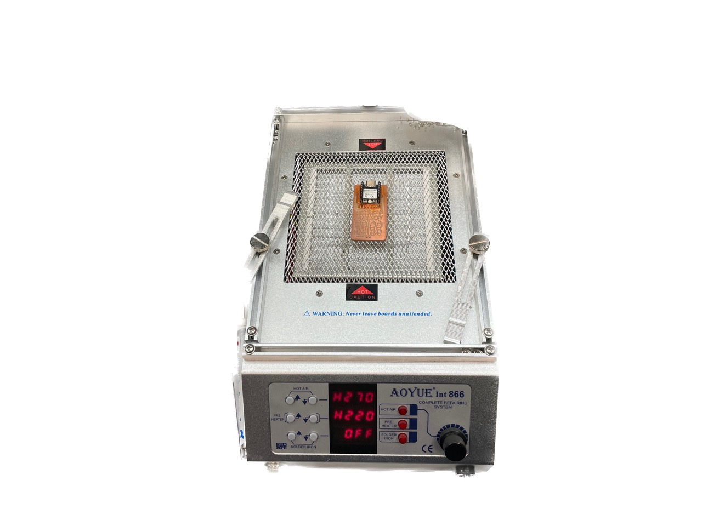
_Hot air station I used_

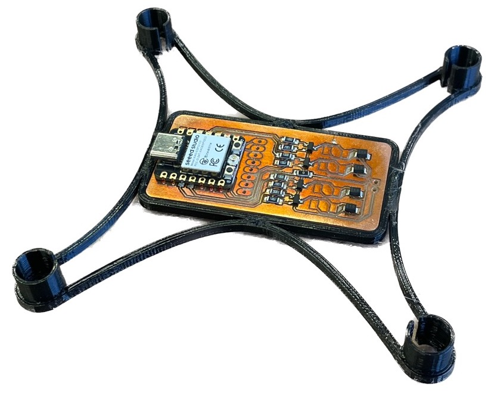
_All the SMD parts put together!_

## Electronics Debugging
What. A. Pain. Writing about this in full details would probably be very boring but the takeaways of my (and Anthony, who helped a ton) suffering is described here:
- Check for shorts **_before_** soldering anything, especially if those pads are unaccessible after!
    - Use a microscope!
    - Use tweezers!
    - Use an x-acto knife!
    - Use compressed air!
    - Use a multimeter in probe mode!
- Use 1/32" and 1/64" end mills. I thought I could do everything with the finer tool, but it left shorts all over my board

I learned these tips the hard way when all but one of the motors worked (the last would always be on). It turned out that the pin controlling that motor was shorted to the battery (via trace _under_ the ESP32 that I can't see) so the gate was always driven high. This is fixed by routing that motor to a different pin (slow, painful) or following the advice above (easy, straightforward).

Now, I still have all but one working motor. For some reason, one of the controllers stopped working.

<video width="1280" autoplay loop muted playsinline>
    <source src="assets/final.mp4" type="video/mp4" />
    Your browser does not support the video tag.
</video>

## PCB Mk4
PCBs v1, v2, and v3 all had shorting issues where a motor was either driven high constantly, never turning on, or stealing power from the microcontroller.

So what did I change in v4?
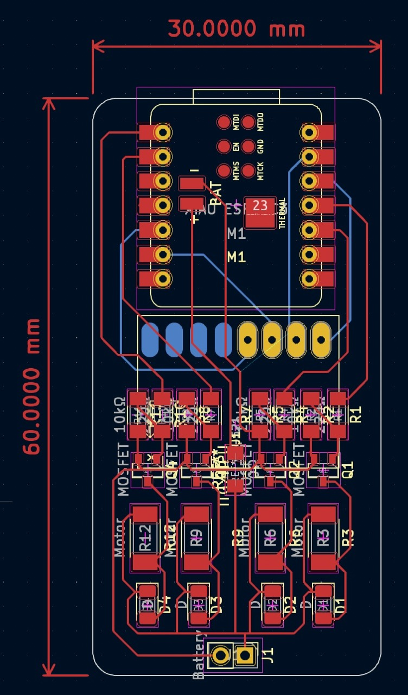
_PCB v4 in KiCad_

Well apart from embracing double sided PCBs and making the traces more spaced apart thanks to the freed space, I changed my milling method. Notably, I used 1/32" in *addition* to 1/64" end mills. I repeat, **do not use 1/64" end mill exclusively.** I used the [Bantam Tools](https://www.bantamtools.com) mill, which is especially nice because it will calculate which traces require the thinner tool. Then, I meticulously checked and cleaned *every single trace* on the PCB under the microscope, using tweezers and compressed air to remove debris. Finally, I probed the pads with a multimeter to check for any shorts. All of this before putting on any parts.

So you would think it worked first try?

## Murphy's Law
Everything that can go wrong, will go wrong.

### Exhibit A _(Strapping Pins)_
The first issue I ran into was the ESP32's GPIO pins seemingly not turning on. Despite being able to flash code and respond to serial, the microcontroller did not want to execute code. The issue turned out to be [strapping Pins](https://pcbartists.com/design/embedded/esp32-c3-gpio-notes-strapping-pins/). For whatever reason, one of the pins I'm using must be driven high at startup or the ESP32C3 will not execute from flash.

Since I have four 10kΩ pull-down resistors in my design, I investigated those first and... somehow a bit of solder flowed *around* three of the four resistors and effectively shorted them. This would've probably been a big headache later on, and it fixed this first issue!

**So watch out for strapping pins!**

### Exhibit B _(AWG)_
Great! Now the microcontroller works, and so do the four motors! What could possibly go wrong?

How about everything (MCU, motor controllers) breaking during the fourth test. Not only did the battery no longer power the microcontroller, but using USB *and* the battery would not turn on the motors. And this happened without any changes or damage.

So what happened? Well motors consume a lot of power, on the order of 1A each. And each copper trace on my PCB can probably handle that without much trouble, but two traces in particular have to handle much more: **Ground** and **BAT+**. The motors are routed in parallel but the junction happens after a long, thin strip of copper down the middle of the board so that one burnt completely.

The fix would be to redesign and mill the PCB, or add jumper wires with adequate [current ratings](https://www.engineeringtoolbox.com/wire-gauges-d_419.html).

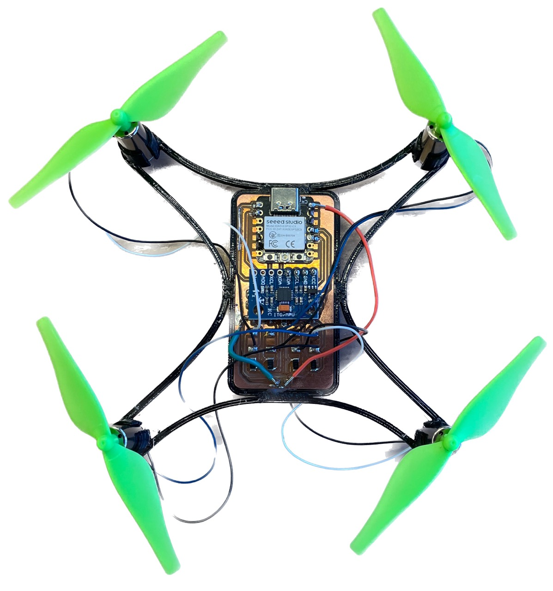
_Don't run lots of power through thin traces!_

### Exhibit C _(AWG, the Sequel)_
Somehow the trace to power the microcontroller also burnt. I'm not sure how, it really shouldn't be drawing that much current. It'd be nice to apply the same fix as before, but the burn happened underneath the MCU (**BAT+** pin isn't exposed) and would be impossible to fix without desoldering a lot of things.

So I connected **BAT+** to **Vin**, which works but has the disadvantage of removing the option to power the drone using both USB and battery.

### Exhibit D _(E = σ/ε)_
<video width="1280" autoplay loop muted playsinline>
    <source src="assets/unstable.mp4" type="video/mp4" />
    Your browser does not support the video tag.
</video>

Pretty self explanatory. There's a ton of vibration in the frame design, so that's probably a bunch of energy wasted and more current drawn. 

## Gyroscope & Accelerometer
Finally! The electronics work. So we can move on to flight software, starting with the IMU.

I'm using the [MPU6050](https://mjwhite8119.github.io/Robots/mpu6050) which is relatively cheap (and old) but has an onboard processor (DMP) that performs sensor fusion for me. That's nice because the ESP32C3 is single-core and will eventually have WiFi bottleneck issues.

<video width="1280" autoplay loop muted playsinline>
    <source src="assets/orientation.mp4" type="video/mp4" />
    Your browser does not support the video tag.
</video>

## Wireless
The reason I'm using the ESP32C3 and not the RP2040 or something along those lines is for its wireless capabilities. I want the tuning software and remote control to be a website. I implemented this in two ways: either the ESP32 acts as an access point (i.e. it becomes its own WiFi network) or joins the same network as my laptop (e.g. *"EECS_Labs"*). Both work and it's a tradeoff of boot-up speed or connection speed.

Either way, the ESP32 hosts a website which I can access via its IP address. Then, that website opens a [WebSocket](https://developer.mozilla.org/en-US/docs/Web/API/WebSockets_API) that I use for bidirectional communication (i.e. user commands <-> telemetry).

Here's a demo of this working. The drone is just spamming the console with its orientation... wirelessly!
<video width="405" autoplay loop muted playsinline>
    <source src="assets/wireless.mp4" type="video/mp4" />
    Your browser does not support the video tag.
</video>

Probably the biggest advantage to using a website rather than a standard RF controller is I can add anything to it. For example, the PID constants can be tuned _wirelessly_ and _without flashing_.

<video width="1280" autoplay loop muted playsinline>
    <source src="assets/controller.mp4" type="video/mp4" />
    Your browser does not support the video tag.
</video>

## PID
Also, what is PID? It stands for Proportional, Integral, Derivative. It approximates the problem of balancing our drone (motors are not made equal. Powering them all will _not_ result in stable flight) using a linear model of the error on each of three orientation axes: yaw, pitch, roll. This is called closed-loop control, as opposed to open-loop which is like driving with your eyes closed (a bad idea).

<video width="1280" autoplay loop muted playsinline>
    <source src="assets/pid.mp4" type="video/mp4" />
    Your browser does not support the video tag.
</video>

It's a little hard to convince this on video, but here the left-most motors increase in speed to counteract the orientation shift.

## Murphy's Law II
Things went well but it's all downhill from here.

### Exhibit E
While tuning the PID, the drone flew off into my arm (it hurts ;_;) and broke one of the motor controllers.
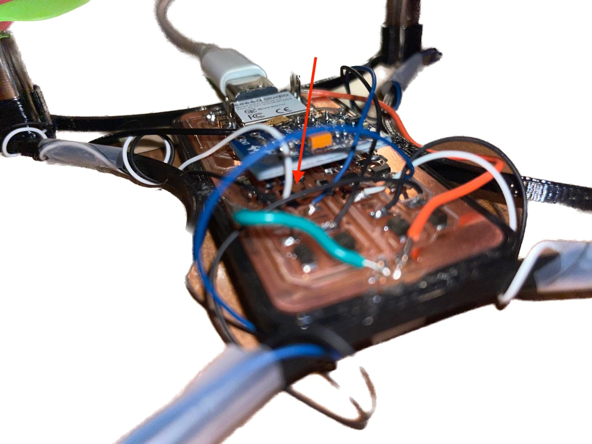
_One of the MOSFETs blew clean off!_

### Exhibit F
<video width="1280" autoplay loop muted playsinline>
    <source src="assets/scope.mp4" type="video/mp4" />
    Your browser does not support the video tag.
</video>

Above is the voltage across the ESP32's power pins. That sudden drop is when the motors turn on, which is enough to reset it. This is due to the motors causing a sudden current spike (stall current is significantly higher than constant) which drops the voltage sufficiently to reset the ESP32. I could fix this with a buck converter or better battery, but I didn't have time for either.

So behold this monstrosity:

<video width="1280" autoplay loop muted playsinline>
    <source src="assets/supply_00.mp4" type="video/mp4" />
    Your browser does not support the video tag.
</video>

It kind of defeats the point of being wireless (which it still is, _technically_!) but I powered the drone using a desktop power supply at 3.7V, 3A MAX.

### Exhibit G
Anddd the topping on the cake is this:

<video width="1280" autoplay loop muted playsinline>
    <source src="assets/supply_01.mp4" type="video/mp4" />
    Your browser does not support the video tag.
</video>

I dropped the drone during testing and another motor broke. At this time, lab was closing and I had no way of fixing this. So the drone may not fly today, but hopefully in the future!

## Summary
I thought making a drone would be a battle split between hardware and software. Apparently not, because electronics is really difficult. What I have so far (~2 weeks of work) doesn't fly but I'll keep iterating!