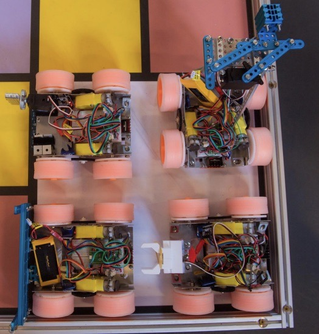
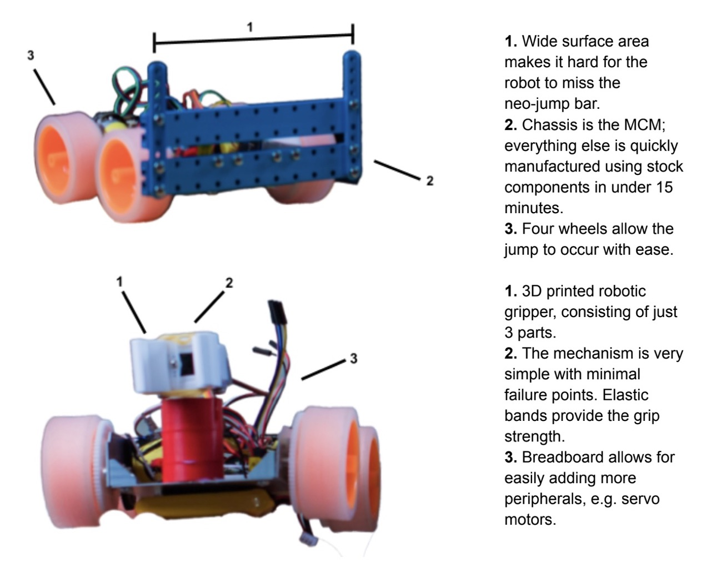
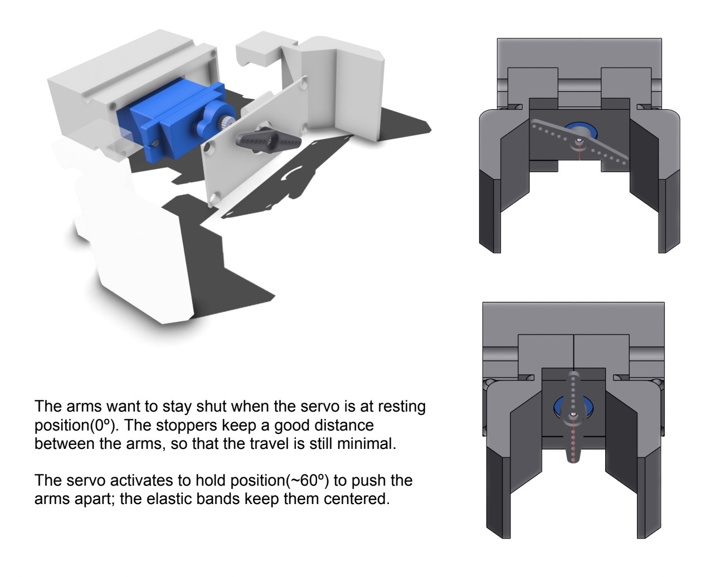

# Fleet-o-Robots (2023)
## MIT 2.S007 Competition

Whereas most people make one (*sometimes* two) robots for MIT's annual competition, I decided to make four. They all function autonomously and cooperate to share the game board's space.

They are programmed in **C++** using the **PlatformIO** SDK. Implemented is a control state machine (sensor input, driving motors and wireless communications) and a dozen wrappers around peripherals (so that everything has a clean **object-oriented** interface).

_The four robots all fitting in the starting block_

_Some specialized features of two of the robots_

_Overview of the gripper design for robot #3_