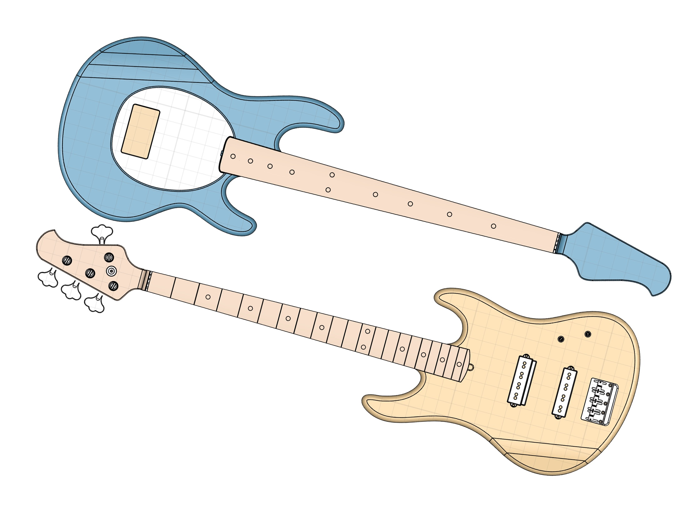
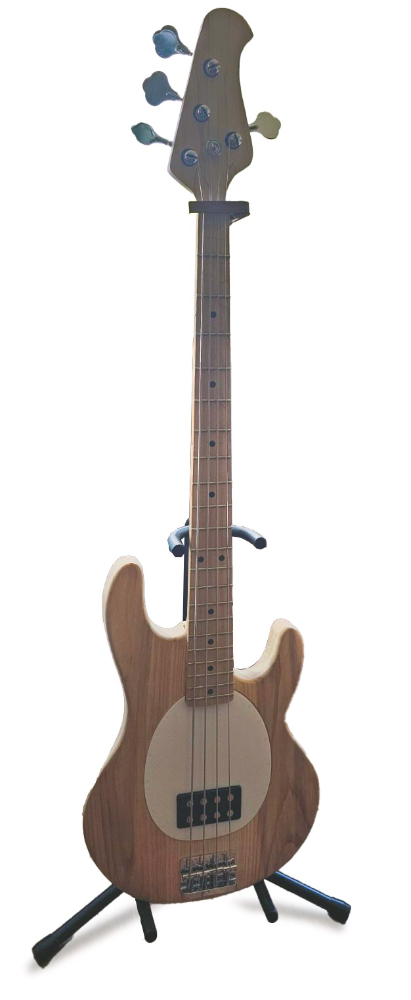

# Bass Guitars

I made **two bass guitars** during my third year in university. The first was because the jam sessions I host with friends would always be missing a bassist, and the second was because I really liked making the first.

## The First
I made this guitar as my final project for [How to Make (Almost) Anything](https://fab.cba.mit.edu/classes/863.23/). You can read the **detailed blog post** [here](https://fab.cba.mit.edu/classes/863.23/EECS/people/Yohan/final/).

It's entirely CNC routed, and the pickups and hardware are made from scratch using 3D printing.

<iframe src="https://collaborate.shapr3d.com/v/-PuaYXoxz8CV7b6QgJEFO" title="Shapr3D Webviewer" class="center" width="640" height="640" frameborder="0" allow="web-share; xr-spatial-tracking" loading="lazy" scrolling="no" referrerpolicy="origin-when-cross-origin" allowfullscreen=""></iframe>

## The Second
A month after finishing the first guitar, I decided to make a second one. This time only the neck was CNC'd while I carved the body using more traditional woodworking methods.

<iframe src="https://collaborate.shapr3d.com/v/3hkFxWleSAtUJDL7DjEK8" title="Shapr3D Webviewer" width="640" height="640" frameborder="0" allow="web-share; xr-spatial-tracking" loading="lazy" scrolling="no" referrerpolicy="origin-when-cross-origin" allowfullscreen></iframe>

_The guitar!_