# CNC Mill
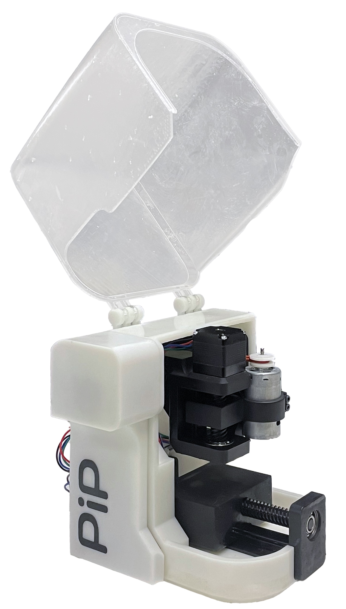
_Lots of gambles and failed prints later, a finished product!_

## CNC Mill, but it's (almost) Entirely 3D Printed

I interned at Formlabs in Summer '24, where I participated in their **annual 48 hour hackathon**. It's a really cool event where Formlings and guests build whatever over a weekend. What I worked on? A desktop CNC mill but **fabricated using (almost) exclusively parts 3D printed** on the [Form 4](https://formlabs.com/3d-printers/form-4/).

For context, CNC mills are generally large, sturdy machines assembled from metal parts (and for a good reason); milling is a subtractive process where some stock material (metal, wood, etc.) is carved away to achieve a desired part. There are [some](https://bitbucket.org/compactpcbmaker/cpcbm/src) CNC's out there that _include_ 3D printed parts, but this project takes it further by using **3D printed linear rails, lead screws, spindle, and frame**.

The motivation behind this machine is that I'm graduating next year and will soon lose access to the CNC mill at school which I use to make PCBs for all of my projects. And the gimmick of 3D printing everything just made sense given, well, Formlabs. So, with my **team** of other talented interns ([Alicia Ramirez](https://www.linkedin.com/in/alicia-ramirez-3992b6219/), [Kevin Tang](https://kvntang.com), [Thomas Larsen](https://www.linkedin.com/in/t-larsen/)), we spent 48 hours making a CNC mill where (almost) everything is entirely 3D printed!

_The team! (ltr: Alicia, Kevin, Me, Thomas)_

## Prototype
Before the hackathon, I threw together a prototype that has the basic elements of what I wanted this project to be. This one is _truly_ entirely 3D printed using Formlabs' [Rigid 4K resin](https://formlabs.com/store/materials/rigid-4000-resin/), and fits on one build plate. I used this to pitch the project idea, gather a team, and as a reference when we brainstormed.

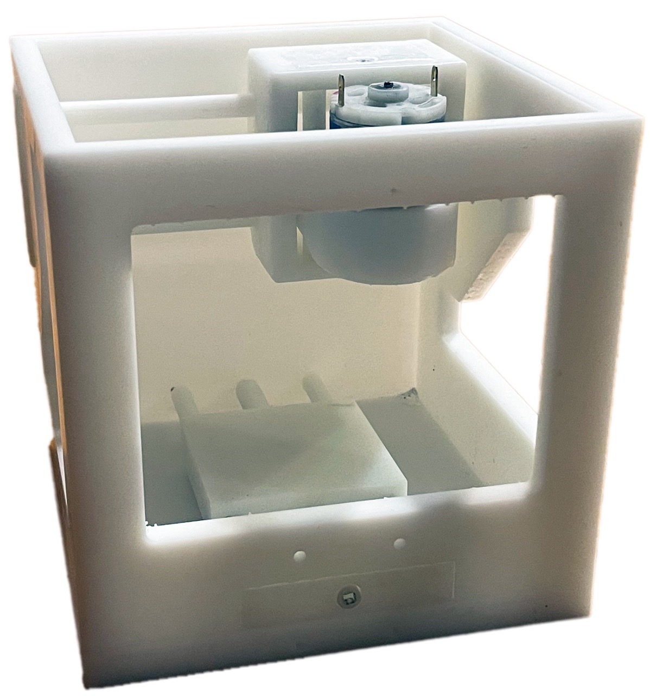
_It's less than an MVP, but gets the point across!_

Unlike the final version, this one has to be manually actuated using a screw driver or drill.

<video width="320" autoplay loop muted playsinline>
    <source src="assets/prototype_jog.mp4" type="video/mp4" />
    Your browser does not support the video tag.
</video>

But, it's very easily assembled within minutes using parts that press fit together.

    <video width="200" autoplay loop muted playsinline style="margin: 0">
        <source src="assets/gantry0.mp4" type="video/mp4" />
        Your browser does not support the video tag.
    </video>
    <video width="200" autoplay loop muted playsinline style="margin: 0">
        <source src="assets/gantry1.mp4" type="video/mp4" />
        Your browser does not support the video tag.
    </video>
    <video width="200" autoplay loop muted playsinline style="margin: 0">
        <source src="assets/gantry2.mp4" type="video/mp4" />
        Your browser does not support the video tag.
    </video>

    <video width="200" autoplay loop muted playsinline style="margin: 0">
        <source src="assets/rail_explosion0.mp4" type="video/mp4" />
        Your browser does not support the video tag.
    </video>
    <video width="200" autoplay loop muted playsinline style="margin: 0">
        <source src="assets/rail_explosion1.mp4" type="video/mp4" />
        Your browser does not support the video tag.
    </video>

## Gantry
[Thomas](https://www.linkedin.com/in/t-larsen/) worked on the linear actuation part of this project. We opted for dovetails instead of linear rails and bushings, for reasons I forgot (probably because long, thin plastic rods are likely to flex). The threads are also 3D printed!

<video width="320" autoplay loop muted playsinline>
    <source src="assets/gantry_cad.mp4" type="video/mp4" />
    Your browser does not support the video tag.
</video>

This is very simple in principle, but fine tuning the tolerances was a lot of work (and even more "failed" prints). We found that using [Black V5 resin](https://formlabs.com/store/materials/black-resin/) resulted in _significantly_ less warping for tall parts. Eventually (well technically within 16 hours but still :P), we got one rail to work:

<video width="320" autoplay loop muted playsinline>
    <source src="assets/rail.mp4" type="video/mp4" />
    Your browser does not support the video tag.
</video>

Since all three axes use this same mechanism, we were able to copy paste the design and print configuration to other parts of the mill. We settled on a tolerance (screw to nut spacing) of 0.2mm, and the week after the hackathon I revisited this idea of 3D printed lead screws to see if we could do a little better.

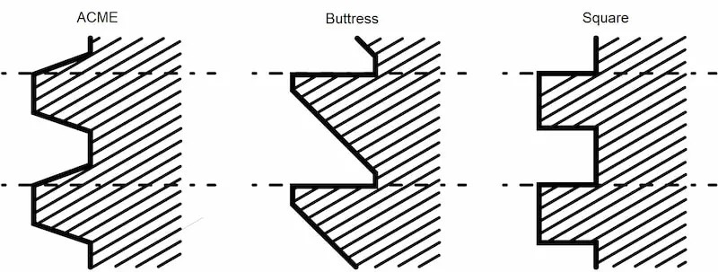
_Types of lead screw thread profiles (source: Fractory)_

The types of thread we used initially was ACME, in the spirit of mimicking metal parts. However, square threads have better power transmission and reduced friction, at the cost of being harder to manufacture (due to the very small draft angle); since we're 3D printing though, it doesn't matter! I experimented with square versus ACME threads at different tolerances and square was better in every scenario. Then, I took this idea a little further and printed lead screws with "inverse trapezoidal" threads:

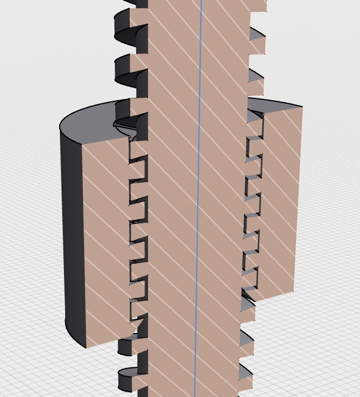
_These threads recess inwards and would be impossible to machine. It's a piece of cake for additive manufacturing, though!_

And somehow, this worked way, *way* better. I'd need to go back and reason out why this is the case but here is this new lead screw with a **50µm** (4 times "less" axial play than before, so virtually no wiggling) tolerance:

<video width="320" autoplay loop muted playsinline>
    <source src="assets/threads.mp4" type="video/mp4" />
    Your browser does not support the video tag.
</video>

Very satisfying, and quite cool that it's exclusive to additive manufacturing!

## Spindle
[Alicia](https://www.linkedin.com/in/alicia-ramirez-3992b6219/) designed the spindle and motor attachment, while also managing the shared [OnShape](https://www.onshape.com/en/) document. We needed to fit a full spindle within a very compact machine, and mimicking other designs wouldn't work because most are too tall. There were also issues of concentricity, as SLA parts are especially prone to warp during the post-cure process.

The design we landed on uses a DC motor mounted adjacent to a spindle compartment, where only the latter truly needs to be straight. The two are joined together using an O-ring which helps cut vibrations.

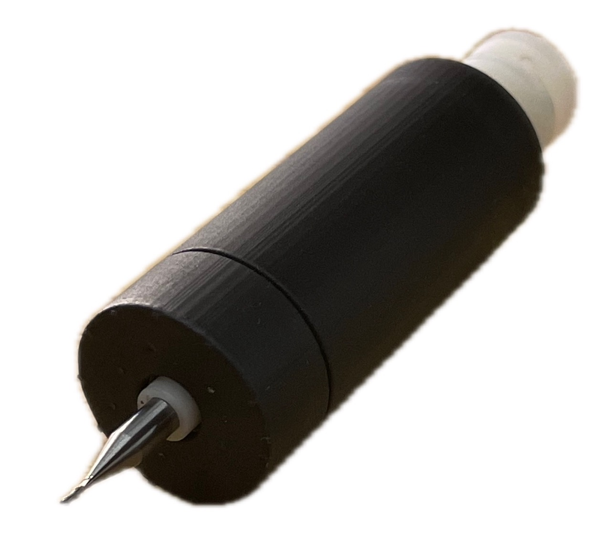
_Spindle compartment, using two ball bearings for rotation and to correct for parts warping_

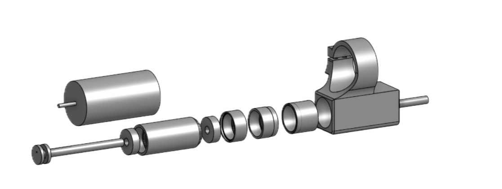
_The spindle is multiple parts that press fit together_

TODO: take an image of the complete assembly irl

## Frame
[Kevin](https://kvntang.com) designed the frame and took charge of the general aesthetic of the machine, which turned out really good! We aimed for something that defies that typical "DIY'd machine" look while also being less industrial looking than professional mills.

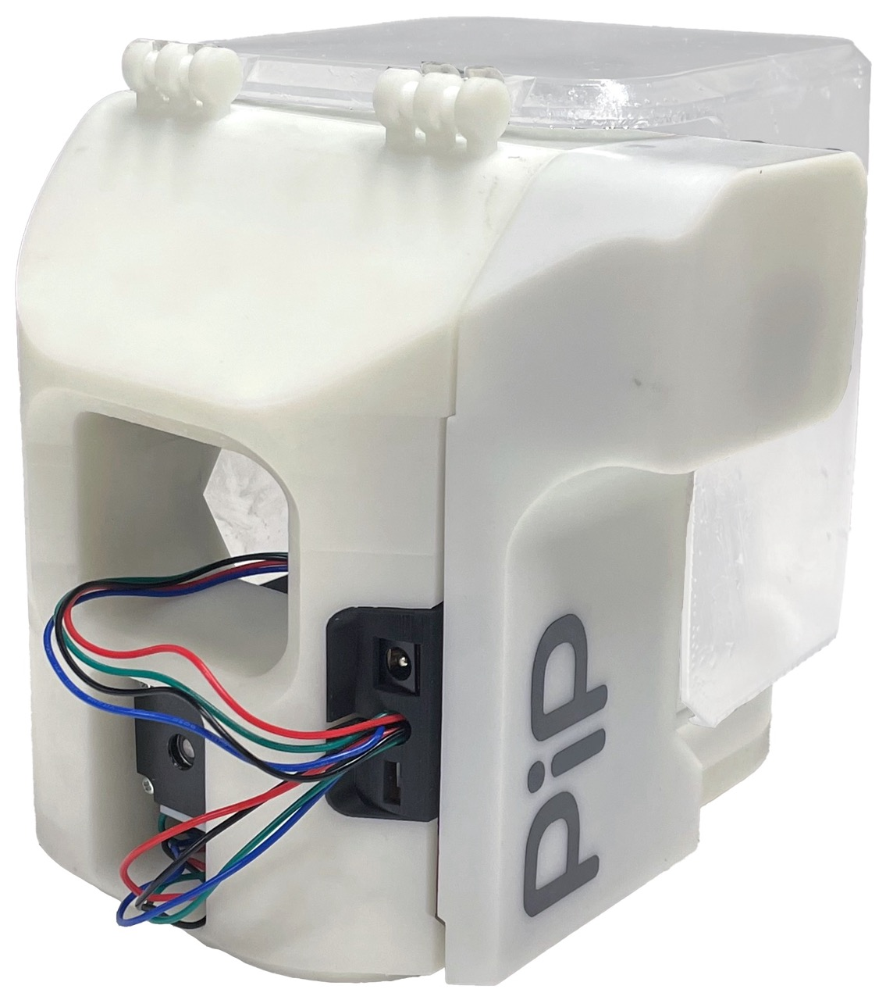
_My favorite part of this: the cable management_

The frame is printed all in one go in Rigid 4K resin, and features holes for the gantries to press fit into.

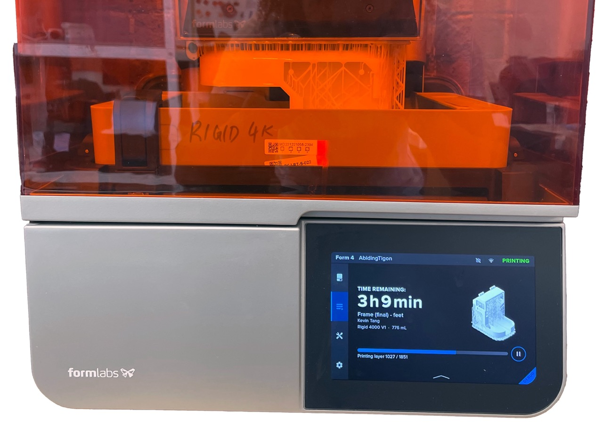
_The frame printing on a Form 4_

## Electronics
Just getting stepper motors to "just move" is famously a pain, so we opted for off-the-shelf [A4988](https://www.amazon.com/HiLetgo-Stepstick-Stepper-Printer-Compatible/dp/B07BND65C8) breakout boards and combined them in a custom PCB. I was able to mill this on a Bantam Tools Mill thanks to EDS' open hours during the summer!

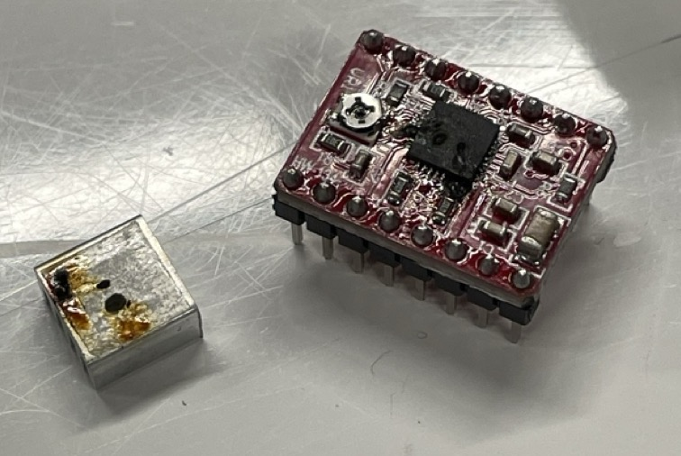
_That did **not** stop me from accidentally setting a stepper motor driver on fire_

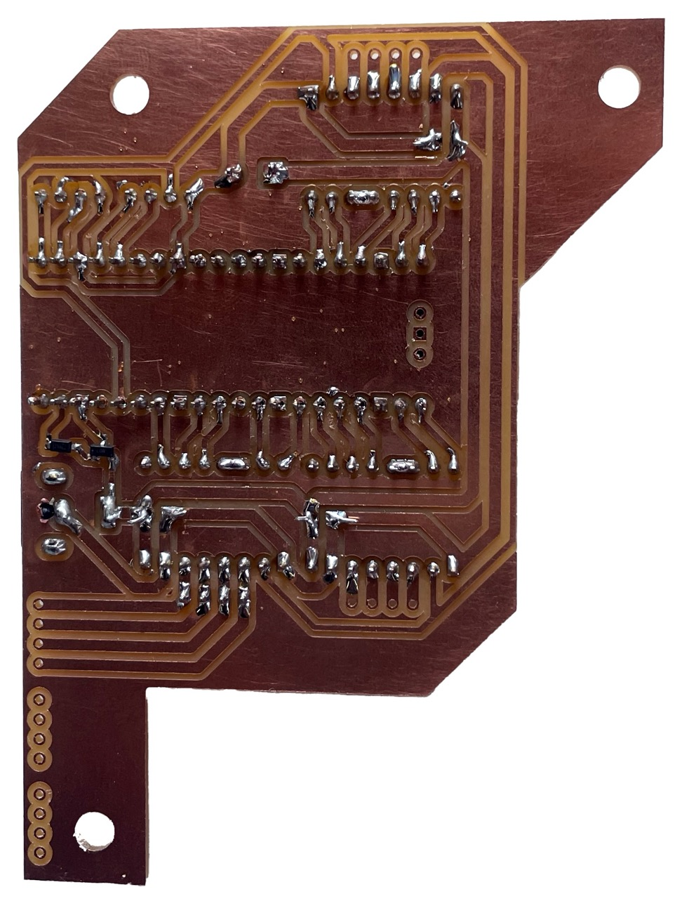
_On the back of the PCB: routes from the motor pins to motor drivers to microcontroller_

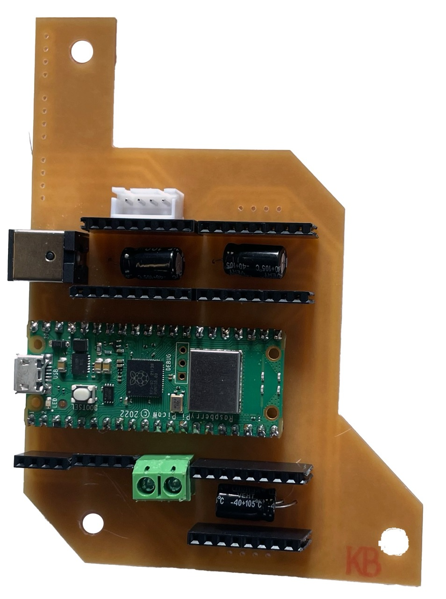
_On the front of the PCB: the components themselves, swappable if anything sets on fire_

We used NEMA-11 stepper motors, which are adorable little motors about half the size of stepper motors you'd find on a 3D printer. To control everything, we are using a Rapsberry Pi Pico W.

## Software
I wrote a custom 3-axis CNC firmware that runs on the Raspberry Pi Pico W. It's very rudimentary but it provides a user interface to jog, home and upload GCode to the machine. Oh, and it's wireless (minus the power cable obviously)!

Currently, a very small subset of the GCode standard is supported (`G00`, `G01` and a few others) but that's good enough for a lot of jobs. The Pico W hosts a webpage (the user interface) that has some client-side logic to miniaturize the GCode to a compact binary; namely, XY planar movements don't need 14-20 bytes of ASCII but only two floats to encode a move. It's a very simple solution to fit entire jobs on the Pico's ~264kB of SRAM.

<video width="320" autoplay loop muted playsinline>
    <source src="assets/first_jog.mp4" type="video/mp4" />
    Your browser does not support the video tag.
</video>

For generating GCode to mill PCBs, I'm using [this](https://copper.carbide3d.com/rapidpcb/) website. Eventually I'd like to integrate everything (layout, CAM, jog, etc.) into one user interface because I really hate jumping between programs for one workflow, but in 48h there was just no way to accomplish all this.

## Does it mill??
Uh, not sure yet. We didn't have time to test "everything integrated all at once" by the end of the hackathon, and I had to catch a flight shortly thereafter. So the machine is now sitting in my room if you're reading this now, I'll likely have a final demo uploaded soon™. Right before my flight, however, I quickly attached a pen in place of the endmill and ran a "hello world" job:

<video width="320" playsinline controls>
    <source src="assets/pen_plotting.mp4" type="video/mp4" />
    Your browser does not support the video tag.
</video>

As you can see, it sounds legit! The pen is _extremely_ wobbly simply because of how I attached it, and has a tendency to drag... so one can only hope the results will be better with the spindle.

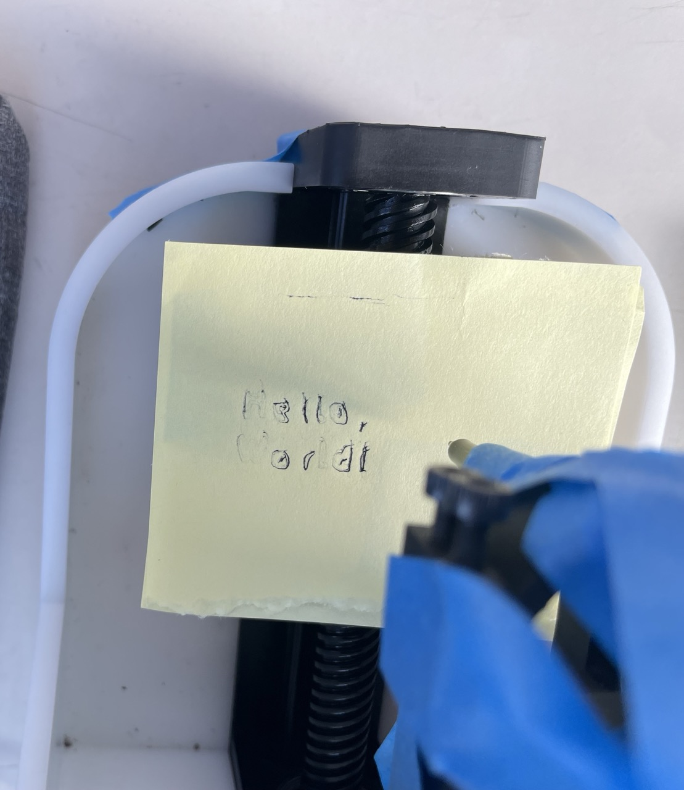
_The results leave a lot to be desired but you can kind of make out the words "Hello, World!"_

_Overlayed with a screen capture of the design in KiCAD_