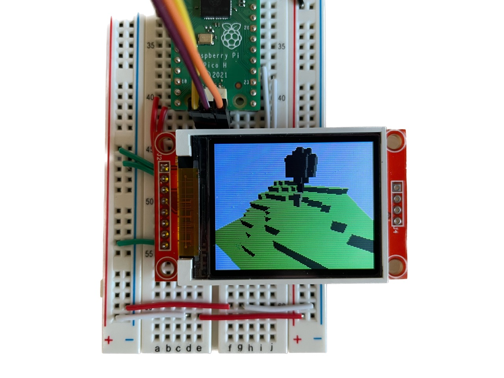
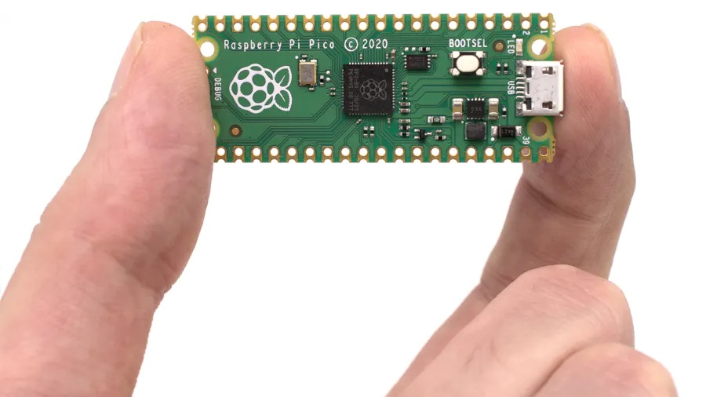
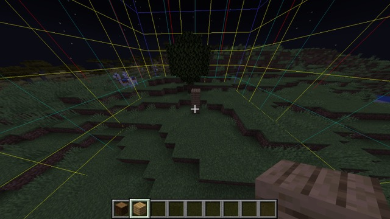

# Picocraft

_This week I am testing the limits of embedded software and hardware._

## Ray-Traced Minecraft on $4 Hardware
The idea is to implement a voxel renderer that runs completely on the [Raspberry Pi Pico](https://www.raspberrypi.com/products/raspberry-pi-pico/), in real(_-ish_) time, and displays it on a small LCD display. Basically, Minecraft on a really cheap microcontroller.

_Raspberry Pi Pico, courtesy of hackster.io_

So what are we working with? Well, the [datasheet for RP2040](https://datasheets.raspberrypi.com/rp2040/rp2040-datasheet.pdf) gives us these numbers:
- 133 MHz Cortex-M0+ Dual-Core Processor
- 264kB SRAM

That is... incredibly low. Don't get me wrong, it's perfectly respectable for a modern microcontroller but it doesn't even begin to compare to the [minimum specs](https://educommunity.minecraft.net/hc/en-us/articles/360047556591-System-Requirements) for running Minecraft. To put it into perspective, my laptop (which barely hits 30fps) has a 3.49GHz processor with many more cores and 16GB of RAM. That's over 26 times faster, times the additional number of cores! And 264kB is about 3 seconds of [compressed audio](https://pamaproaudio.com/free-audio-file-size-calculator/), or a 200px by 300px [PNG file](https://toolstud.io/photo/filesize.php?imagewidth=200&imageheight=300).

## LCD Display
First, I needed to get some LCD display working with the Pico. The lab had some of these [1.8" Adafruit breakout boards](https://a.co/d/0b5BqOW) for the ST7735 lying around, so I went with that. It has a resolution of 160x128 pixels which is perfect for my use case; having more pixels to draw would just make the project harder. So I created a [Rust](https://www.rust-lang.org/) project using the [RP2040 HAL crate](https://docs.rs/rp2040-hal/latest/rp2040_hal/), wrote boilerplate for some [ST7735 drivers](https://github.com/sajattack/st7735-lcd-rs) I found online andddd:

<video width="720" height="405" autoplay loop muted playsinline>
    <source src="assets/tft_slow.mp4" type="video/mp4" />
    Your browser does not support the video tag.
</video>

The issue here isn't the flicker. I programmed the green LED to toggle on/off whenever the CPU is finished updating the screen, and the video above is in realtime so we've got a big problem: rendering the display alone takes ages! Ideally, the green LED should appear static to the human eye (because it's blinking so fast) and the CPU should be busy for even less time than that. Ok, let's go down this rabbit hole.

## SPI
I decided to write my own drivers for the ST7735 (the chip on the LCD display) loosely based off the [datasheet](https://www.displayfuture.com/Display/datasheet/controller/ST7735.pdf) and [these](https://github.com/cbm80amiga/Arduino_ST7735_Fast/blob/master/Arduino_ST7735_Fast.cpp) [two](https://github.com/sajattack/st7735-lcd-rs) libraries. The idea is very simple: Pico <-> SPI <-> ST7735, where SPI refers to the serial protocol (as opposed to e.g. I2C). Then it's just a matter of sending the right bytes (commands, data) in the right order.

## DMA
The biggest issue with just about every ST7735 driver is that it blocks the CPU while pixels are being transmitted to the screen. It's possible to just increase the SPI baudrate to drop that time from a dozen milliseconds to just a few, but that's still a considerable amount of time for a processor. What I'd like is for the CPU to be free to render the next frame while the current frame is being transmitted over SPI.

In comes direct memory access (DMA). It's hardware on the processor that can only perform *memcpy*'s, e.g. SRAM <-> SRAM, SPI <-> SRAM, PIO <-> SRAM, etc. It isn't exclusive to the RP2040, but for some reason ST7735 drivers online don't make use of it. For my project, I store a contiguous screen buffer (i.e. size 128 x 160 pixels) that the CPU can take its time updating. Meanwhile, DMA will transmit that buffer over SPI to the display. So from the side of the CPU, it's like displaying every pixel at once rather than one at a time.

The immediate speed benefits from this are pretty good, but more importantly the CPU is busy for _nanoseconds_ per frame. Big upgrade!

## Double Buffering
A common technique in computer graphics is double buffering. As the name implies, it involves using two screen buffers: one for drawing and the other to display. What does this mean? Well with one buffer, you're necessarily doing the CPU Render -> DMA Display -> CPU Render -> etc. pipeline sequentially. Attempting to update the screen buffer while it's being uploaded results in visual artifacts. With two buffers, the CPU and DMA can touch mutually exclusive memory and "swap" when both are done with the current frame. 

## Faulty Hardware!
I spent a whole day writing ST7735 drivers and speed wise, it's way better than alternatives online. The only issue is it didn't work:
<video width="720" height="405" autoplay loop muted playsinline>
    <source src="assets/tft_glitch.mp4" type="video/mp4" />
    Your browser does not support the video tag.
</video>

It turns out the display I used was broken... when I replaced it:

<video width="720" height="405" autoplay loop muted playsinline>
    <source src="assets/tft_ok.mp4" type="video/mp4" />
    Your browser does not support the video tag.
</video>

Much better. There's still some noticeable flicker, which is due to the lack of vsync (i.e. the pixels being uploaded are racing the scanline updating the physical LCD) but good enough. In practice, you wouldn't dramatically change the whole screen (green <-> plane picture) like this anyways.

## 3D Rendering
There are three rendering methods I was considering for this project.
- [*Rasterization*](https://en.wikipedia.org/wiki/Rasterisation): This is the most typical for video games. It involves creating geometry (i.e. meshes of triangles) and projecting those flat relative to the camera. Its performance scales (roughly) with the amount of geometry.
- [*Doom-esque Rendering*](https://en.wikipedia.org/wiki/Rasterisation): It isn't _really_ 3D, but clever hacks that reduce perspective warping. It works especially well for tall walls around the camera but things like looking up/down are limited.
- [*Raytracing*](https://en.wikipedia.org/wiki/Ray_tracing_(graphics)): Simulates light rays for every pixel on the camera. More advanced implementations can simulate light bounces too (e.g. path tracing) and it's the preferred approach for realistic renders. Performance scales (roughly) with the size of the screen.

## Raytracing
I chose raytracing because the screen I'm drawing to is relatively small. Also, voxels require a considerable amount of geometry which is expensive on 264kB of SRAM or computationally inefficient if we don't cache. Also, raytracing in a voxel grid is very efficient (in fact it's used as an [optimization](https://en.wikipedia.org/wiki/Binary_space_partitioning) for more complex raytracers).

The first step in raytracing is ray _casting_. The latter is shooting one ray into the world and yielding what it hit, whereas the former is shooting a whole bunch of those rays to create an image. So once raycasting is implemented, the rest is trivial. I chose [this algorithm](http://www.cse.yorku.ca/~amana/research/grid.pdf) (A. Woo) and used [this implementation](https://github.com/fenomas/fast-voxel-raycast) as reference.

I hard-coded a basic 3D model into the program, then animated the camera to move forward:
<video width="1081" height="636" autoplay loop muted playsinline>
    <source src="assets/render_slowest.mp4" type="video/mp4" />
    Your browser does not support the video tag.
</video>

## Fixed-Point Arithmetic
So first implementation is _really_ slow. Why? Well it turns out that the RP2040 doesn't have a [floating-point unit (FPU)](https://en.wikipedia.org/wiki/Floating-point_unit) so any operations involving *f32* or *f64* is emulated via software. This is really expensive, and these types are designed for precision which is really redundant when your output is a 160 x 128 screen.

I found [this paper](https://people.ece.cornell.edu/land/courses/ece4760/RP2040/C_SDK_fixed_pt/index_fixed.html) which compares floating point to fixed point arithmetic on the Pico. Fixed point is implemented with integer operations so it's a lot faster at the cost of precision and range.

To test this, I implemented a 32-bit *Fixed* type with a 15-bit fractional part. Depending on the use case, it may make more sense to shift around this integer/decimal distribution, or even drop down to a 16-bit representation, but I opted for simple first. Still, this drop-in replacement is a lot faster:
<video width="799" height="720" autoplay loop muted playsinline>
    <source src="assets/render_slow.mp4" type="video/mp4" />
    Your browser does not support the video tag.
</video>

## Multicore Processing
The Pico has _two_ cores, and so far I've been using just one. So let's add what is probably the most obvious "optimization." With raytracing, this is trivial: *core0* renders the first half of the screen, and *core1* renders the rest. These regions can operate independently and don't overlap:
<video width="1216" height="720" autoplay loop muted playsinline>
    <source src="assets/render_fast.mp4" type="video/mp4" />
    Your browser does not support the video tag.
</video>

## Overclocking
One last touch is just making the processor faster. The Pico will run at 125MHz if you don't tell it anything, but it's safe to double that. Some people have even [reached 436MHz](https://forums.raspberrypi.com/viewtopic.php?t=301902)! This makes performance about twice as good, but I didn't want to push it farther since it risks damaging the hardware.

## It's 3D??
If you're not convinced everything I've been showing is actually 3D, here is the same model spinning:
<video width="1216" height="720" autoplay loop muted playsinline>
    <source src="assets/render_spin.mp4" type="video/mp4" />
    Your browser does not support the video tag.
</video>

## Due dates!!
I was out during the weekend and had all of two days to start and finish the project. So I started running out of time and had to put aside my dream of running Minecraft on the Pico. Instead, I'll completely forgo the gameplay and focus on the graphics. But to make it cool, I created a Minecraft plugin using [Spigot](https://www.spigotmc.org) that will communicate with the Pico to transmit world data over:
<video width="1043" height="720" autoplay loop muted playsinline>
    <source src="assets/chunk_spin.mp4" type="video/mp4" />
    Your browser does not support the video tag.
</video>

_I'm running a modded server that transmits whatever chunk the player is in to the Pico_

## Lambert Shading
Finally, I added simple [lambert shading](https://www.scratchapixel.com/lessons/3d-basic-rendering/introduction-to-shading/diffuse-lambertian-shading.html) which makes it look a lot nicer:
<video width="917" height="720" autoplay loop muted playsinline>
    <source src="assets/final_product.mp4" type="video/mp4" />
    Your browser does not support the video tag.
</video>

[Download the source code + uf2](assets/code.zip) (170kB)